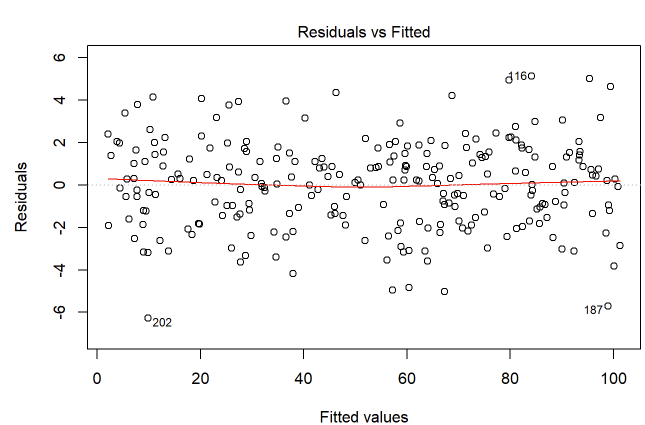
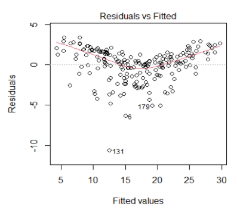
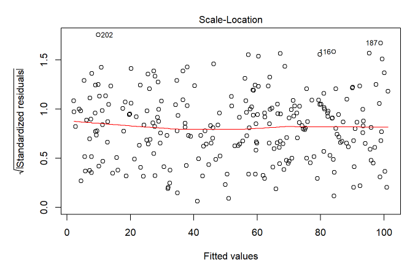
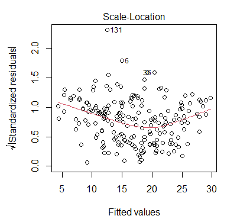

```{r data_analysis, include = FALSE}

#------------------------------------------------------------------------------
# datos
#------------------------------------------------------------------------------

#----------------------------------------------------------
# tabla 3.2
#----------------------------------------------------------

data_table_3_2 <- read.table(
text="
person  y x x_q xy
1 2 8 64  16
2 3 9 81  27
3 3 9 81  27
4 4 10  100 40
5 7 6 36  42
6 5 7 49  35
7 5 4 16  20
8 7 5 25  35
9 8 3 9 24
10  9 1 1 9
11  9 2 4 18
12  10  2 4 20

",
header=TRUE, stringsAsFactors = FALSE)

#--------------------------------------
# mostrar tabla
#--------------------------------------

knitr::kable(data_table_3_2)

#------------------------------------------------------------------------------
# ajustar modelos
#------------------------------------------------------------------------------

#--------------------------------------
# preparar datos codigo base
#--------------------------------------

data_model <- data_table_3_2[, c('y','x')]
data_model$x_cgm <- data_table_3_2$x - mean(data_table_3_2$x, na.rm = TRUE)


#--------------------------------------
# preparar datos (dplyr)
#--------------------------------------

data_model <- data_table_3_2 %>%
              mutate(x_g = mean(x, na.rm = TRUE)) %>%
              mutate(x_cgm = x - x_g) %>%
              dplyr::select(y, x, x_cgm) %>%
              dplyr::glimpse()


#--------------------------------------
# mostrar datos
#--------------------------------------

knitr::kable(data_model)

#--------------------------------------
# formulas
#--------------------------------------

f00 <- as.formula(y ~ + 1)
f01 <- as.formula(y ~ + 1 + x)
f02 <- as.formula(y ~ + 1 + x_cgm)

#--------------------------------------
# ajustar modelos
#--------------------------------------

m00 <- lm(f00, data = data_model)
m01 <- lm(f01, data = data_model)
m02 <- lm(f02, data = data_model)

#--------------------------------------
# comparar modelos de forma sintética
#--------------------------------------

texreg::screenreg(
    list(m00, m01, m02),
    star.symbol = "*", 
    center = TRUE, 
    doctype = FALSE,
    dcolumn = TRUE, 
    booktabs = TRUE,
    single.row = FALSE
    )

#--------------------------------------
# tamaño de efecto de la relación
#--------------------------------------

# como r de Pearson
with(data_model, cor(y, x))

# como R2
summary(m02)$r.squared

# R2 obtenido con library(broom)
broom::glance(m02)


#------------------------------------------------------------------------------
# proyección
#------------------------------------------------------------------------------

#----------------------------------------------------------
# intercepto
#----------------------------------------------------------

b00_m01 <- lm(y ~ + 1 + x, data = data_model) %>%
           broom::tidy() %>%
           dplyr::filter(term == '(Intercept)') %>%
           dplyr::select(estimate) %>%
           dplyr::pull()


b01_m01 <- lm(y ~ + 1 + x, data = data_model) %>%
           broom::tidy() %>%
           dplyr::filter(term == 'x') %>%
           dplyr::select(estimate) %>%
           dplyr::pull()

#----------------------------------------------------------
# agregar valores esperados (y_hat), a una base de datos
#----------------------------------------------------------

fitted_values <- lm(y ~ + 1 + x, data = data_model) %>%
                 predict()

data_plot_raw <- data_model %>%
                 mutate(y_hat = fitted_values)

#----------------------------------------------------------
# proyección de modelo sobre datos observados
#----------------------------------------------------------

data_plot_raw %>%
ggplot(., aes(y = y, x = x)) + 
geom_point(alpha = .3, col = 'grey20') + 
  geom_smooth(
    formula = y ~ x,
    method = "lm", 
    se = FALSE, 
    colour = "grey90",
    alpha = .005
    ) +
# intercepto
geom_point(aes(y = b00_m01, x = 0), col = 'red', alpha = .5) +
# itercepto
geom_abline(
  intercept = b00_m01, 
  slope = 0, 
  color="red", 
  linetype="dashed", 
  size= .3
  ) +
annotate('text', 
  x =   0, 
  y =  b00_m01 + .5, 
  size = 4,
  vjust = 0,
  colour = 'red',
  label = paste0('b[0]'),
  parse = TRUE
  ) +   
# beta 1
geom_abline(
  intercept = b00_m01 + b01_m01, 
  slope = 0, 
  color="red", 
  linetype="dashed", 
  size= .3
  ) +
annotate('text', 
  x =  1, 
  y =  b00_m01 + (b01_m01)/2, 
  size = 4,
  hjust = 0,
  colour = 'red',
  label = paste0('b[01]'),
  parse = TRUE
  ) +   
xlab('x variable') +
ylab('y variable') + 
scale_x_continuous(breaks=seq(0,11,1), limits = c(0, 11)) +
scale_y_continuous(breaks=seq(0,11,1), limits = c(0, 11)) +
labs(
  title = expression(y[i] == b[0] + b[1] * x[i] + epsilon[i]),
  parse = TRUE
  ) +
theme_linedraw()

#------------------------------------------------------------------------------
# proyección
#------------------------------------------------------------------------------

#----------------------------------------------------------
# intercepto
#----------------------------------------------------------


b00_m02 <- lm(y ~ + 1 + x_cgm, data = data_model) %>%
           broom::tidy() %>%
           dplyr::filter(term == '(Intercept)') %>%
           dplyr::select(estimate) %>%
           dplyr::pull()


b01_m02 <- lm(y ~ + 1 + x_cgm, data = data_model) %>%
           broom::tidy() %>%
           dplyr::filter(term == 'x_cgm') %>%
           dplyr::select(estimate) %>%
           dplyr::pull()

#----------------------------------------------------------
# agregar valores esperados (y_hat), a una base de datos
#----------------------------------------------------------

fitted_values <- lm(y ~ + 1 + x_cgm, data = data_model) %>%
                 predict()

data_plot_cen <- data_model %>%
                 mutate(y_hat = fitted_values)

#----------------------------------------------------------
# proyección de modelo sobre datos observados
#----------------------------------------------------------

data_plot_cen %>%
ggplot(., aes(y = y, x = x_cgm)) + 
geom_point(alpha = .3, col = 'grey20') + 
  geom_smooth(
    formula = y ~ x,
    method = "lm", 
    se = FALSE, 
    colour = "grey90",
    alpha = .005
    ) +
# punto del intercepto
geom_point(aes(y = b00_m02, x = 0), col = 'red', alpha = .5) +
# linea del intercepto
geom_abline(
  intercept = b00_m02, 
  slope = 0, 
  color="red", 
  linetype="dashed", 
  size= .3
  ) +
annotate('text', 
  x =   0, 
  y =  b00_m02 + .5, 
  size = 4,
  vjust = 0,
  colour = 'red',
  label = paste0('b[0]'),
  parse = TRUE
  ) +   
# beta 1
geom_abline(
  intercept = b00_m02 + b01_m02, 
  slope = 0, 
  color="red", 
  linetype="dashed", 
  size= .3
  ) +
annotate('text', 
  x =  1, 
  y =  b00_m02 + (b01_m02)/2, 
  size = 4,
  hjust = 0,
  colour = 'red',
  label = paste0('b[1]'),
  parse = TRUE
  ) +   
xlab(expression((x[i] - bar(x)[i]))) +
ylab('y variable') + 
scale_y_continuous(breaks=seq(0,11,1), limits = c(0, 11)) +
scale_x_continuous(breaks=seq(-6,6,1), limits = c(-6, 6)) +
labs(
  title = expression(y[i] == b[0] + b[1] * (x[i] - bar(x)[i]) + epsilon[i]),
  parse = TRUE
  ) +
theme_linedraw()

#------------------------------------------------------------------------------
# residuales
#------------------------------------------------------------------------------

#----------------------------------------------------------
# crear valores esperados
#----------------------------------------------------------

fitted_values <- lm(y ~ + 1 + x, data = data_model) %>%
                 predict()

#----------------------------------------------------------
# agregar valores esperados (y_hat), a una base de datos
#----------------------------------------------------------

data_fitted <- data_model %>%
               mutate(y_hat = fitted_values)

#----------------------------------------------------------
# lollipop plot
#----------------------------------------------------------

data_fitted %>%
ggplot(., aes(y = y, x = x)) + 
geom_point(alpha = .3, col = 'grey20') + 
  geom_smooth(
    formula = y ~ x,
    method = "lm", 
    se = FALSE, 
    colour = "grey90",
    alpha = .005
    ) +
geom_segment(aes(xend = x, yend = y_hat), alpha = .4, col = 'red') + 
geom_point(aes(y = y_hat), col = 'grey25', alpha = .5) + 
xlab('x variable') +
ylab('y variable') + 
scale_x_continuous(breaks=seq(0,10,1), limits = c(0, 10)) +
scale_y_continuous(breaks=seq(0,10,1), limits = c(0, 10)) +
ggtitle('Residuals') +
theme_linedraw()


#------------------------------------------------------------------------------
# errores cuadrados
#------------------------------------------------------------------------------

#----------------------------------------------------------
# crear valores esperados
#----------------------------------------------------------

fitted_values <- lm(y ~ + 1 + x, data = data_model) %>%
                 predict()

#----------------------------------------------------------
# agregar valores esperados (y_hat), a una base de datos
#----------------------------------------------------------

data_fitted <- data_model %>%
               mutate(y_hat = fitted_values) %>%
               mutate(res = y - y_hat) %>%
               mutate(res_colour = case_when(
                res == 0 ~ 'grey80',
                res > 0 ~ '#247BA0', # red
                res < 0 ~ '#FB3640'  # blue
                ))

rect_colour <- data_fitted$res_colour

#----------------------------------------------------------
# lollipop plot
#----------------------------------------------------------

data_fitted %>%
ggplot(., aes(y = y, x = x)) + 
geom_point(alpha = 1, col = 'grey20') + 
ylim(0,12) +
xlim(0,12) +
  geom_smooth(
    formula = y ~x,
    method = "lm", 
    se = FALSE, 
    colour = "grey90",
    alpha = .005
    ) +
geom_rect(
   aes(
   xmin=x, 
   xmax=x+res, 
   ymin=y-res, 
   ymax=y
   ), 
  colour = 'grey20',
  fill=rect_colour, 
  alpha=0.5
  ) +
xlab('x variable') +
ylab('y variable') + 
ggtitle('Squared Errors') +
theme_linedraw()

#------------------------------------------------------------------------------
# errores cuadrados
#------------------------------------------------------------------------------

#----------------------------------------------------------
# función SSE
#----------------------------------------------------------

sse_model <- function(model){

y     <- model$model[,1]
y_hat <- model$fitted.values
squared_errors <- (y - y_hat)^2
sse <- sum(squared_errors)

return(sse)
}

#----------------------------------------------------------
# extraer SSE
#----------------------------------------------------------

sse_00 <- sse_model(m00)
sse_01 <- sse_model(m01)
sse_02 <- sse_model(m02)

#----------------------------------------------------------
# crear tabla
#----------------------------------------------------------

sse_table <- data.frame(
  model = c(
    'null model', 
    'augmented model', 
    'centered x model'
    ),
  see = c(sse_00, sse_01, sse_02)
  )
  
#----------------------------------------------------------
# mostrar tabla
#----------------------------------------------------------

knitr::kable(sse_table, digits = 2)

#------------------------------------------------------------------------------
# des composicion de errores
#------------------------------------------------------------------------------

#----------------------------------------------------------
# obtener medidas de error
#----------------------------------------------------------

total_error <- sse_00
residual_error <- sse_01
explained_error <- total_error - residual_error


#----------------------------------------------------------
# crear tabla
#----------------------------------------------------------

error_table <- data.frame(
  error = c(
    'Total Error', 
    'Residual Error', 
    'Explained Error'
    ),
  value = c(
    total_error, 
    residual_error, 
    explained_error
    )
  )

#----------------------------------------------------------
# mostrar tabla
#----------------------------------------------------------

knitr::kable(error_table, digits = 2)

#----------------------------------------------------------
# proporcion de varianza explicada
#----------------------------------------------------------

# proporción de SSE sobre el total
explained_error/total_error

# R2 del modelo
summary(m01)$r.squared

```


class: title-slide, middle, center

background-image: url(img/background_01.jpeg)
background-size: 100%

```{r echo=FALSE, out.width = '2%', out.height = '2%'}
knitr::include_graphics('./img/blank_space.png')
```


.line_space_08[

## Metodología Cuantitativa Avanzada I

### .text_70[
Fundamentos de los modelos lineales
]

]

<br>
<br>

.line_space_03[
.white[

.text_70[

Carrasco, D., PhD

.text_60[Centro de Medición MIDE UC]

]

<br>

.text_70[PSI4035]

.text_70[Santiago, Marzo 16 de 2022]
  
  ]
]

<br>

---


class: middle, inverse

background-image: url(img/background_02.jpeg)
background-size: 100%


.line_space_01[
Taller
]
.line_space_01[
.text_250[
.bold_white[
Modelos de regresión
]
]
]
.line_space_01[
Ajuste de modelos de regresión bivariada
]


<br>
<br>

---

background-image: url(img/background_03.jpeg)
background-size: 100%

.pull_l_50_t_080[

### Taller 1: Fundamentos de los de los modelos lineales

En esta sesión vamos a ilustrar empleando a R diferentes conceptos y operaciones introducidos por Vik (2014) en los capítulos 1 a 3.

Los conceptos que vamos a revisar son:

- variable dependiente o variable de respuesta
- variable independiente, covariable o variable predictora
- ecuación de un modelo de regresión
- suma de errores al cuadrado
- evaluar supuestos de un modelo de regresión
  - linealidad
  - homocedasticidad
  - normalida de los residuos


]

.pull_r_50_t_080[

### Librerías en uso

- Para ejecutar el presente código, estamos empleando las siguientes librerias:
  - `library(dplyr)` para manipular datos
  - `library(knitr)` para mostrar las tablas como texto plano en consola
  - `library(ggplot2)` para construir gráficos con más opciones
  - `library(texreg)` para reordenar los output de varios de modelos de regresión
  - `library(broom)` para extraer tablas de los output de los modelos de regresión
  - `library(lmtest)` para aplicar la prueba de Durbin Watson (correlación de residuales)

Para instalar estas librerías podemos ejecutar los siguientes códigos

```{r , echo=TRUE, eval = FALSE}

#------------------------------------------------------------------------------
# instalar librerias
#------------------------------------------------------------------------------

#----------------------------------------------------------
# librerias
#----------------------------------------------------------

install.packages('tidyverse') # incluye a dplyr y ggplot2
                              # junto a otras librerias útiles

install.packages('knitr')     # para mostrar tablas como texto plano

install.packages('texreg')    # para reordenar los output de varios 
                              # de modelos de regresión

install.packages('broom')     # para extraer tablas de los output
                              # de los modelos de regresión

install.packages('lmtest')    # para evaluar la independencia 
                              # de las residuales

```

]

---

background-image: url(img/background_03.jpeg)
background-size: 100%

.pull_l_50_t_080[

### Modelo de regresión con un predictor (*bivariate regression*)

Vik (2014) plantea, que podemos plantearnos tres preguntas generales acerca de dos variables:

- Q1: estan relacionadas estas dos variables?
- Q2: cuál es la dirección de la relación?
- Q3: que tan grande es la relación ente estas variables?

Para abordar estas preguntas empleando R, primero vamos a cargar los datos de la tabla 3.2.
Luego de haber cargado estados datos, vamos a visualizar los datos mediante un dispersiograma o *scatter plot*.
Finalmente, vamos ajustar dos modelos de regressión: el modelo sin predictores (modelo nulo, o modelo compacto), y el modelo con predictores (modelo aumentado).


]

.pull_r_50_t_080[

### Cargar datos Tabla 3.2

```{r , echo=TRUE, eval=FALSE}

#------------------------------------------------------------------------------
# datos
#------------------------------------------------------------------------------

#----------------------------------------------------------
# tabla 3.2
#----------------------------------------------------------

data_table_3_2 <- read.table(
text="
person  y x x_q xy
1 2 8 64  16
2 3 9 81  27
3 3 9 81  27
4 4 10  100 40
5 7 6 36  42
6 5 7 49  35
7 5 4 16  20
8 7 5 25  35
9 8 3 9 24
10  9 1 1 9
11  9 2 4 18
12  10  2 4 20

",
header=TRUE, stringsAsFactors = FALSE)

#--------------------------------------
# mostrar tabla
#--------------------------------------

knitr::kable(data_table_3_2)

```

```text


| person|  y|  x| x_q| xy|
|------:|--:|--:|---:|--:|
|      1|  2|  8|  64| 16|
|      2|  3|  9|  81| 27|
|      3|  3|  9|  81| 27|
|      4|  4| 10| 100| 40|
|      5|  7|  6|  36| 42|
|      6|  5|  7|  49| 35|
|      7|  5|  4|  16| 20|
|      8|  7|  5|  25| 35|
|      9|  8|  3|   9| 24|
|     10|  9|  1|   1|  9|
|     11|  9|  2|   4| 18|
|     12| 10|  2|   4| 20|

```

]

---


class: middle, inverse

background-image: url(img/background_02.jpeg)
background-size: 100%


.line_space_01[
Taller
]
.line_space_01[
.text_250[
.bold_white[
Visualización de datos
]
]
]
.line_space_01[
Exploración gráfica de los datos
]


<br>
<br>

---

background-image: url(img/background_03.jpeg)
background-size: 100%

.pull_l_50_t_080[

### Scatter plot tabla 3.2

```{r , echo=TRUE, eval=FALSE}

#------------------------------------------------------------------------------
# datos
#------------------------------------------------------------------------------

#----------------------------------------------------------
# tabla 3.2
#----------------------------------------------------------

data_table_3_2 <- read.table(
text="
person  y x x_q xy
1 2 8 64  16
2 3 9 81  27
3 3 9 81  27
4 4 10  100 40
5 7 6 36  42
6 5 7 49  35
7 5 4 16  20
8 7 5 25  35
9 8 3 9 24
10  9 1 1 9
11  9 2 4 18
12  10  2 4 20

",
header=TRUE, stringsAsFactors = FALSE)

#------------------------------------------------------------------------------
# scatter
#------------------------------------------------------------------------------

#--------------------------------------
# codigo base
#--------------------------------------

with(data_table_3_2,
  plot(
    x=x,
    y=y,
    xlab = "X variable", 
    ylab = "Y variable",        
    main = 'Scatter',
    pch = 19,
    frame = TRUE
    )
  )

```

]

.pull_r_50_t_080[

### Scatter con código base

```{r , echo=FALSE, warning=FALSE}

#------------------------------------------------------------------------------
# datos
#------------------------------------------------------------------------------

#----------------------------------------------------------
# tabla 3.2
#----------------------------------------------------------

data_table_3_2 <- read.table(
text="
person  y x x_q xy
1 2 8 64  16
2 3 9 81  27
3 3 9 81  27
4 4 10  100 40
5 7 6 36  42
6 5 7 49  35
7 5 4 16  20
8 7 5 25  35
9 8 3 9 24
10  9 1 1 9
11  9 2 4 18
12  10  2 4 20

",
header=TRUE, stringsAsFactors = FALSE)

#------------------------------------------------------------------------------
# scatter
#------------------------------------------------------------------------------

#--------------------------------------
# codigo base
#--------------------------------------

with(data_table_3_2,
  plot(
    x=x,
    y=y,
    xlab = "X variable", 
    ylab = "Y variable",        
    main = 'Scatter',
    pch = 19,
    frame = TRUE
    )
  )

```

]

---

background-image: url(img/background_03.jpeg)
background-size: 100%

.pull_l_50_t_080[

### Scatter plot tabla 3.2

```{r , echo=TRUE, eval=FALSE}

#------------------------------------------------------------------------------
# datos
#------------------------------------------------------------------------------

#----------------------------------------------------------
# tabla 3.2
#----------------------------------------------------------

data_table_3_2 <- read.table(
text="
person  y x x_q xy
1 2 8 64  16
2 3 9 81  27
3 3 9 81  27
4 4 10  100 40
5 7 6 36  42
6 5 7 49  35
7 5 4 16  20
8 7 5 25  35
9 8 3 9 24
10  9 1 1 9
11  9 2 4 18
12  10  2 4 20

",
header=TRUE, stringsAsFactors = FALSE)

#------------------------------------------------------------------------------
# scatter
#------------------------------------------------------------------------------

#--------------------------------------
# codigo ggplot
#--------------------------------------

library(dplyr)
library(ggplot2)

data_table_3_2 %>%
ggplot(., aes(y = y, x = x)) + 
geom_point(alpha = 1, col = 'black') + 
xlab('x variable') +
ylab('y variable') + 
ggtitle('Scatter plot') +
theme_linedraw()


```

]

.pull_r_50_t_080[

### Scatter con *ggplot2*

```{r , echo=FALSE, warning=FALSE}

#------------------------------------------------------------------------------
# datos
#------------------------------------------------------------------------------

#----------------------------------------------------------
# tabla 3.2
#----------------------------------------------------------

data_table_3_2 <- read.table(
text="
person  y x x_q xy
1 2 8 64  16
2 3 9 81  27
3 3 9 81  27
4 4 10  100 40
5 7 6 36  42
6 5 7 49  35
7 5 4 16  20
8 7 5 25  35
9 8 3 9 24
10  9 1 1 9
11  9 2 4 18
12  10  2 4 20

",
header=TRUE, stringsAsFactors = FALSE)

#------------------------------------------------------------------------------
# scatter
#------------------------------------------------------------------------------

#--------------------------------------
# codigo ggplot
#--------------------------------------

library(dplyr)
library(ggplot2)

data_table_3_2 %>%
ggplot(., aes(y = y, x = x)) + 
geom_point(alpha = 1, col = 'black') + 
xlab('x variable') +
ylab('y variable') + 
ggtitle('Scatter plot') +
theme_linedraw()


```

]

---


class: middle, inverse

background-image: url(img/background_02.jpeg)
background-size: 100%


.line_space_01[
Taller
]
.line_space_01[
.text_250[
.bold_white[
Ajuste de modelos
]
]
]
.line_space_01[
Especificación de modelos de regresión
]


<br>
<br>

---

background-image: url(img/background_03.jpeg)
background-size: 100%

.pull_l_50_t_070[

### Ajustar modelo de regresión


Los modelos de regressión que vamos a ajustar son los siguientes:

Modelo Compacto o Modelo Nulo

$$y_{i} = \beta_{0} + \epsilon_{i}$$

Modelo Aumentado, de un solo predictor

$$y_{i} = \beta_{0} + \beta_{1}x_{i} + \epsilon_{i}$$

Modelo Aumentado, con un predictor centrado a la gran media

$$y_{i} = \beta_{0} + \beta_{1}(x_{i} - \bar{x}_{i}) + \epsilon_{i}$$

Para ajustar los modelos anteriores, primero vamos a preparar los datos.
Vamos a centrar a la variable `x`, y vamos a crear la variable `x_cgm`

```{r , echo=TRUE, warning=FALSE, eval=FALSE}

#------------------------------------------------------------------------------
# ajustar modelos
#------------------------------------------------------------------------------

#--------------------------------------
# preparar datos codigo base
#--------------------------------------

data_model <- data_table_3_2[, c('y','x')]
data_model$x_cgm <- data_table_3_2$x - mean(data_table_3_2$x, na.rm = TRUE)


#--------------------------------------
# preparar datos (dplyr)
#--------------------------------------

data_model <- data_table_3_2 %>%
              mutate(x_g = mean(x, na.rm = TRUE)) %>%
              mutate(x_cgm = x - x_g) %>%
              dplyr::select(y, x, x_cgm) %>%
              dplyr::glimpse()

```


]

.pull_r_50_t_070[

### Datos preparados

```{r , echo=TRUE, warning=FALSE, eval=FALSE}

#--------------------------------------
# mostrar datos
#--------------------------------------

knitr::kable(data_model)


```

```text

|  y|  x| x_cgm|
|--:|--:|-----:|
|  2|  8|   2.5|
|  3|  9|   3.5|
|  3|  9|   3.5|
|  4| 10|   4.5|
|  7|  6|   0.5|
|  5|  7|   1.5|
|  5|  4|  -1.5|
|  7|  5|  -0.5|
|  8|  3|  -2.5|
|  9|  1|  -4.5|
|  9|  2|  -3.5|
| 10|  2|  -3.5|

```
### Ajustar modelos

```{r , echo=TRUE, warning=FALSE, eval=FALSE}

#--------------------------------------
# formulas
#--------------------------------------

f00 <- as.formula(y ~ + 1)
f01 <- as.formula(y ~ + 1 + x)
f02 <- as.formula(y ~ + 1 + x_cgm)

#--------------------------------------
# ajustar modelos
#--------------------------------------

m00 <- lm(f00, data = data_model)
m01 <- lm(f01, data = data_model)
m02 <- lm(f02, data = data_model)


```

]

---

background-image: url(img/background_03.jpeg)
background-size: 100%

.pull_l_50_t_070[

### Resultados de los modelos ajustados

```{r , echo=TRUE, warning=FALSE, eval=FALSE}

#------------------------------------------------------------------------------
# ajustar modelos
#------------------------------------------------------------------------------

#--------------------------------------
# formulas
#--------------------------------------

f00 <- as.formula(y ~ + 1)
f01 <- as.formula(y ~ + 1 + x)
f02 <- as.formula(y ~ + 1 + x_cgm)

#--------------------------------------
# ajustar modelos
#--------------------------------------

m00 <- lm(f00, data = data_model)
m01 <- lm(f01, data = data_model)
m02 <- lm(f02, data = data_model)

#--------------------------------------
# comparar modelos de forma sintética
#--------------------------------------

texreg::screenreg(
    list(m00, m01, m02),
    star.symbol = "*", 
    center = TRUE, 
    doctype = FALSE,
    dcolumn = TRUE, 
    booktabs = TRUE,
    single.row = FALSE
    )


```

```text

============================================
             Model 1    Model 2    Model 3  
--------------------------------------------
(Intercept)   6.00 ***  10.27 ***   6.00 ***
             (0.78)     (0.76)     (0.36)   
x                       -0.78 ***           
                        (0.12)              
x_cgm                              -0.78 ***
                                   (0.12)   
--------------------------------------------
R^2           0.00       0.80       0.80    
Adj. R^2      0.00       0.79       0.79    
Num. obs.    12         12         12       
============================================
 *** p < 0.001; ** p < 0.01; * p < 0.05
 


```

]

.pull_r_50_t_070[


### Tamaños de efecto

```{r , echo=TRUE, warning=FALSE, eval=TRUE}

#--------------------------------------
# tamaño de efecto de la relación
#--------------------------------------

# como r de Pearson
with(data_model, cor(y, x))

# como R2
summary(m02)$r.squared

# R2 obtenido con library(broom)
broom::glance(m02)


```

**Abordando las preguntas básicas de Vik**

- Q1: estan relacionadas estas dos variables?
  - Sí, la variable `y` esta relacionada de forma lineal a la variable `x`.
- Q2: cuál es la dirección de la relación?
  - La forma de la relación es negativa.
  - A medida que aumentan los valores de `x`, esperamos que los valores `y` disminuyan.
- Q3: que tan grande es la relación entre estas variables?
  - La relación es grande. `x` e `y`, presentan una correlación alta ( $r$ = -.89 ).
  - En términos de varianza explicada, `x` explica hasta un 80% de la varianza de `y` ( $R^2$ = .80 )

]

---


class: middle, inverse

background-image: url(img/background_02.jpeg)
background-size: 100%


.line_space_01[
Taller
]
.line_space_01[
.text_250[
.bold_white[
Resultados de modelos de regresión
]
]
]
.line_space_01[
Inspección básica de los outputs de regresión
]


<br>
<br>

---

background-image: url(img/background_03.jpeg)
background-size: 100%

.pull_l_50_t_070[

#### Resultados del modelo nulo

```{r , echo=TRUE, warning=FALSE}

#------------------------------------------------------------------------------
# resultados
#------------------------------------------------------------------------------

#--------------------------------------
# coeficientes
#--------------------------------------

summary(m00)

#--------------------------------------
# análisis de varianza
#--------------------------------------

anova(m00)

```

]

.pull_r_50_t_070[

#### Resultados del modelo con un predictor

```{r , echo=TRUE, warning=FALSE}

#------------------------------------------------------------------------------
# resultados
#------------------------------------------------------------------------------

#--------------------------------------
# coeficientes
#--------------------------------------

summary(m01)

#--------------------------------------
# análisis de varianza
#--------------------------------------

anova(m01)

```

]

---


class: middle, inverse

background-image: url(img/background_02.jpeg)
background-size: 100%


.line_space_01[
Taller
]
.line_space_01[
.text_250[
.bold_white[
Interpretación de los modelos ajustados]
]
]
.line_space_01[
Representación geométrica de los modelos ajustados
]


<br>
<br>

---

background-image: url(img/background_03.jpeg)
background-size: 100%


**Interpretación (m00)**

.pull_l_50_t_050[

- Intercepto ( $b_{0}$ )
- Coeficiente de regresión ( $b_{1}$ )

```{r , echo=TRUE, warning=FALSE, eval=FALSE}

#------------------------------------------------------------------------------
# proyección
#------------------------------------------------------------------------------

#----------------------------------------------------------
# intercepto
#----------------------------------------------------------

b00_m01 <- lm(y ~ + 1 + x, data = data_model) %>%
           broom::tidy() %>%
           dplyr::filter(term == '(Intercept)') %>%
           dplyr::select(estimate) %>%
           dplyr::pull()


b01_m01 <- lm(y ~ + 1 + x, data = data_model) %>%
           broom::tidy() %>%
           dplyr::filter(term == 'x') %>%
           dplyr::select(estimate) %>%
           dplyr::pull()

#----------------------------------------------------------
# agregar valores esperados (y_hat), a una base de datos
#----------------------------------------------------------

fitted_values <- lm(y ~ + 1 + x, data = data_model) %>%
                 predict()

data_plot_raw <- data_model %>%
                 mutate(y_hat = fitted_values)

#----------------------------------------------------------
# proyección de modelo sobre datos observados
#----------------------------------------------------------

data_plot_raw %>%
ggplot(., aes(y = y, x = x)) + 
geom_point(alpha = .3, col = 'grey20') + 
  geom_smooth(
    formula = y ~ x,
    method = "lm", 
    se = FALSE, 
    colour = "grey90",
    alpha = .005
    ) +
# intercepto
geom_point(aes(y = b00_m01, x = 0), col = 'red', alpha = .5) +
# itercepto
geom_abline(
  intercept = b00_m01, 
  slope = 0, 
  color="red", 
  linetype="dashed", 
  size= .3
  ) +
annotate('text', 
  x =   0, 
  y =  b00_m01 + .5, 
  size = 4,
  vjust = 0,
  colour = 'red',
  label = paste0('b[0]'),
  parse = TRUE
  ) +   
# beta 1
geom_abline(
  intercept = b00_m01 + b01_m01, 
  slope = 0, 
  color="red", 
  linetype="dashed", 
  size= .3
  ) +
annotate('text', 
  x =  1, 
  y =  b00_m01 + (b01_m01)/2, 
  size = 4,
  hjust = 0,
  colour = 'red',
  label = paste0('b[01]'),
  parse = TRUE
  ) +   
xlab('x variable') +
ylab('y variable') + 
scale_x_continuous(breaks=seq(0,11,1), limits = c(0, 11)) +
scale_y_continuous(breaks=seq(0,11,1), limits = c(0, 11)) +
labs(
  title = expression(y[i] == b[0] + b[1] * x[i] + epsilon[i]),
  parse = TRUE
  ) +
theme_linedraw()

```

]

.pull_r_50_t_080[


```{r , echo=FALSE, warning=FALSE, eval=TRUE}

#------------------------------------------------------------------------------
# proyección
#------------------------------------------------------------------------------

#----------------------------------------------------------
# proyección de modelo sobre datos observados
#----------------------------------------------------------

data_plot_raw %>%
ggplot(., aes(y = y, x = x)) + 
geom_point(alpha = .3, col = 'grey20') + 
  geom_smooth(
    formula = y ~ x,
    method = "lm", 
    se = FALSE, 
    colour = "grey90",
    alpha = .005
    ) +
# intercepto
geom_point(aes(y = b00_m01, x = 0), col = 'red', alpha = .5) +
# itercepto
geom_abline(
  intercept = b00_m01, 
  slope = 0, 
  color="red", 
  linetype="dashed", 
  size= .3
  ) +
annotate('text', 
  x =   0, 
  y =  b00_m01 + .5, 
  size = 4,
  vjust = 0,
  colour = 'red',
  label = paste0('b[0]'),
  parse = TRUE
  ) +   
# beta 1
geom_abline(
  intercept = b00_m01 + b01_m01, 
  slope = 0, 
  color="red", 
  linetype="dashed", 
  size= .3
  ) +
annotate('text', 
  x =  1, 
  y =  b00_m01 + (b01_m01)/2, 
  size = 4,
  hjust = 0,
  colour = 'red',
  label = paste0('b[01]'),
  parse = TRUE
  ) +   
xlab('x variable') +
ylab('y variable') + 
scale_x_continuous(breaks=seq(0,11,1), limits = c(0, 11)) +
scale_y_continuous(breaks=seq(0,11,1), limits = c(0, 11)) +
labs(
  title = expression(y[i] == b[0] + b[1] * x[i] + epsilon[i]),
  parse = TRUE
  ) +
theme_linedraw()

```

]

---

background-image: url(img/background_03.jpeg)
background-size: 100%


**Interpretación (m01)**

.pull_l_50_t_050[

- Intercepto ( $b_{0}$ ), cuando $x_{i} - \bar{x}_{i}$ es el predictor
- Coeficiente de regresión ( $b_{1}$ )

```{r , echo=TRUE, warning=FALSE, eval=FALSE}

#------------------------------------------------------------------------------
# proyección
#------------------------------------------------------------------------------

#----------------------------------------------------------
# intercepto
#----------------------------------------------------------


b00_m02 <- lm(y ~ + 1 + x_cgm, data = data_model) %>%
           broom::tidy() %>%
           dplyr::filter(term == '(Intercept)') %>%
           dplyr::select(estimate) %>%
           dplyr::pull()


b01_m02 <- lm(y ~ + 1 + x_cgm, data = data_model) %>%
           broom::tidy() %>%
           dplyr::filter(term == 'x_cgm') %>%
           dplyr::select(estimate) %>%
           dplyr::pull()

#----------------------------------------------------------
# agregar valores esperados (y_hat), a una base de datos
#----------------------------------------------------------

fitted_values <- lm(y ~ + 1 + x_cgm, data = data_model) %>%
                 predict()

data_plot_cen <- data_model %>%
                 mutate(y_hat = fitted_values)

#----------------------------------------------------------
# proyección de modelo sobre datos observados
#----------------------------------------------------------

data_plot_cen %>%
ggplot(., aes(y = y, x = x_cgm)) + 
geom_point(alpha = .3, col = 'grey20') + 
  geom_smooth(
    formula = y ~ x,
    method = "lm", 
    se = FALSE, 
    colour = "grey90",
    alpha = .005
    ) +
# punto del intercepto
geom_point(aes(y = b00_m02, x = 0), col = 'red', alpha = .5) +
# linea del intercepto
geom_abline(
  intercept = b00_m02, 
  slope = 0, 
  color="red", 
  linetype="dashed", 
  size= .3
  ) +
annotate('text', 
  x =   0, 
  y =  b00_m02 + .5, 
  size = 4,
  vjust = 0,
  colour = 'red',
  label = paste0('b[0]'),
  parse = TRUE
  ) +   
# beta 1
geom_abline(
  intercept = b00_m02 + b01_m02, 
  slope = 0, 
  color="red", 
  linetype="dashed", 
  size= .3
  ) +
annotate('text', 
  x =  1, 
  y =  b00_m02 + (b01_m02)/2, 
  size = 4,
  hjust = 0,
  colour = 'red',
  label = paste0('b[1]'),
  parse = TRUE
  ) +   
xlab(expression((x[i] - bar(x)[i]))) +
ylab('y variable') + 
scale_y_continuous(breaks=seq(0,11,1), limits = c(0, 11)) +
scale_x_continuous(breaks=seq(-6,6,1), limits = c(-6, 6)) +
labs(
  title = expression(y[i] == b[0] + b[1] * (x[i] - bar(x)[i]) + epsilon[i]),
  parse = TRUE
  ) +
theme_linedraw()

```

]

.pull_r_50_t_080[


```{r , echo=FALSE, warning=FALSE, eval=TRUE}

#------------------------------------------------------------------------------
# proyección
#------------------------------------------------------------------------------

#----------------------------------------------------------
# proyección de modelo sobre datos observados
#----------------------------------------------------------

data_plot_cen %>%
ggplot(., aes(y = y, x = x_cgm)) + 
geom_point(alpha = .3, col = 'grey20') + 
  geom_smooth(
    formula = y ~ x,
    method = "lm", 
    se = FALSE, 
    colour = "grey90",
    alpha = .005
    ) +
# punto del intercepto
geom_point(aes(y = b00_m02, x = 0), col = 'red', alpha = .5) +
# linea del intercepto
geom_abline(
  intercept = b00_m02, 
  slope = 0, 
  color="red", 
  linetype="dashed", 
  size= .3
  ) +
annotate('text', 
  x =   0, 
  y =  b00_m02 + .5, 
  size = 4,
  vjust = 0,
  colour = 'red',
  label = paste0('b[0]'),
  parse = TRUE
  ) +   
# beta 1
geom_abline(
  intercept = b00_m02 + b01_m02, 
  slope = 0, 
  color="red", 
  linetype="dashed", 
  size= .3
  ) +
annotate('text', 
  x =  1, 
  y =  b00_m02 + (b01_m02)/2, 
  size = 4,
  hjust = 0,
  colour = 'red',
  label = paste0('b[1]'),
  parse = TRUE
  ) +   
xlab(expression((x[i] - bar(x)[i]))) +
ylab('y variable') + 
scale_y_continuous(breaks=seq(0,11,1), limits = c(0, 11)) +
scale_x_continuous(breaks=seq(-6,6,1), limits = c(-6, 6)) +
labs(
  title = expression(y[i] == b[0] + b[1] * (x[i] - bar(x)[i]) + epsilon[i]),
  parse = TRUE
  ) +
theme_linedraw()


```

.text_80[
>Nota: El centrado de variable es útil para darle una interpretación sustantiva al intercepto del modelo ajustado.
]

]

---

background-image: url(img/background_03.jpeg)
background-size: 100%


**Interpretación (m01)**

.pull_l_50_t_080[

#### Interpretación de resultados

**Intercepto** ( $b_{0}$ )

- $b_{0}$ corresponde a la media de $y_{i}$, cuando $x_{i}$ es ingresado al modelo con sus valores centrados.
- Otra forma de interpretar este estimado, es que $b_{0}$ es el valor esperado de $y_{i}$, cuando $(x_{i} - \bar{x}_{i}) = 0$.
- En otras palabras, $b_{0}$ es el valor que esperamos de $y_{i}$, a valores promedio de $x_{i}$.

**Coeficiente** ( $b_{1}$ )

- $b_{1}$ corresponde al valor que esperamos que tome $y_{i}$, condicional al cambio de una unidad de $x_{i}$.
- Empleando los resultados del modelo ajustado (*m02*), esperamos que los casos donde $(x_{i} - \bar{x}_{i}) = 1$, obtengan $b_{0} + b_{1}$ valores en la escala de $y_{i}$.

]

.pull_r_50_t_080[


```{r , echo=FALSE, warning=FALSE, eval=TRUE}

#------------------------------------------------------------------------------
# proyección
#------------------------------------------------------------------------------

#----------------------------------------------------------
# proyección de modelo sobre datos observados
#----------------------------------------------------------

data_plot_cen %>%
ggplot(., aes(y = y, x = x_cgm)) + 
geom_point(alpha = .3, col = 'grey20') + 
  geom_smooth(
    formula = y ~ x,
    method = "lm", 
    se = FALSE, 
    colour = "grey90",
    alpha = .005
    ) +
# punto del intercepto
geom_point(aes(y = b00_m02, x = 0), col = 'red', alpha = .5) +
# linea del intercepto
geom_abline(
  intercept = b00_m02, 
  slope = 0, 
  color="red", 
  linetype="dashed", 
  size= .3
  ) +
annotate('text', 
  x =   0, 
  y =  b00_m02 + .5, 
  size = 4,
  vjust = 0,
  colour = 'red',
  label = paste0('b[0]'),
  parse = TRUE
  ) +   
# beta 1
geom_abline(
  intercept = b00_m02 + b01_m02, 
  slope = 0, 
  color="red", 
  linetype="dashed", 
  size= .3
  ) +
annotate('text', 
  x =  1, 
  y =  b00_m02 + (b01_m02)/2, 
  size = 4,
  hjust = 0,
  colour = 'red',
  label = paste0('b[1]'),
  parse = TRUE
  ) +   
xlab(expression((x[i] - bar(x)[i]))) +
ylab('y variable') + 
scale_y_continuous(breaks=seq(0,11,1), limits = c(0, 11)) +
scale_x_continuous(breaks=seq(-6,6,1), limits = c(-6, 6)) +
labs(
  title = expression(y[i] == b[0] + b[1] * (x[i] - bar(x)[i]) + epsilon[i]),
  parse = TRUE
  ) +
theme_linedraw()


```

]


---


class: middle, inverse

background-image: url(img/background_02.jpeg)
background-size: 100%


.line_space_01[
Taller
]
.line_space_01[
.text_250[
.bold_white[
Visualización de errores]
]
]
.line_space_01[
Representación geométrica de los residuales del modelo
]


<br>
<br>


---

background-image: url(img/background_03.jpeg)
background-size: 100%


#### Lollipop plot de Residuales

.pull_l_50_t_080[

```{r , echo=TRUE, warning=FALSE, eval = FALSE}

#------------------------------------------------------------------------------
# residuales
#------------------------------------------------------------------------------

#----------------------------------------------------------
# crear valores esperados
#----------------------------------------------------------

fitted_values <- lm(y ~ + 1 + x, data = data_model) %>%
                 predict()

#----------------------------------------------------------
# agregar valores esperados (y_hat), a una base de datos
#----------------------------------------------------------

data_fitted <- data_model %>%
               mutate(y_hat = fitted_values)

#----------------------------------------------------------
# lollipop plot
#----------------------------------------------------------

data_fitted %>%
ggplot(., aes(y = y, x = x)) + 
geom_point(alpha = .3, col = 'grey20') + 
  geom_smooth(
    formula = y ~ x,
    method = "lm", 
    se = FALSE, 
    colour = "grey90",
    alpha = .005
    ) +
geom_segment(aes(xend = x, yend = y_hat), alpha = .4, col = 'red') + 
geom_point(aes(y = y_hat), col = 'grey25', alpha = .5) + 
xlab('x variable') +
ylab('y variable') + 
scale_x_continuous(breaks=seq(0,10,1), limits = c(0, 10)) +
scale_y_continuous(breaks=seq(0,10,1), limits = c(0, 10)) +
ggtitle('Residuals') +
theme_linedraw()

```

]

.pull_r_50_t_080[


```{r , echo=FALSE, warning=FALSE, eval=TRUE}

#----------------------------------------------------------
# lollipop plot
#----------------------------------------------------------

data_fitted %>%
ggplot(., aes(y = y, x = x)) + 
geom_point(alpha = .3, col = 'grey20') + 
  geom_smooth(
    formula = y ~ x,
    method = "lm", 
    se = FALSE, 
    colour = "grey90",
    alpha = .005
    ) +
geom_segment(aes(xend = x, yend = y_hat), alpha = .4, col = 'red') + 
geom_point(aes(y = y_hat), col = 'grey25', alpha = .5) + 
xlab('x variable') +
ylab('y variable') + 
scale_x_continuous(breaks=seq(0,10,1), limits = c(0, 10)) +
scale_y_continuous(breaks=seq(0,10,1), limits = c(0, 10)) +
ggtitle('Residuals') +
theme_linedraw()


```

]


---

background-image: url(img/background_03.jpeg)
background-size: 100%

#### Squared errors

.pull_l_50_t_080[

```{r , echo=TRUE, warning=FALSE, eval = FALSE}

#------------------------------------------------------------------------------
# errores cuadrados
#------------------------------------------------------------------------------

#----------------------------------------------------------
# crear valores esperados
#----------------------------------------------------------

fitted_values <- lm(y ~ + 1 + x, data = data_model) %>%
                 predict()

#----------------------------------------------------------
# agregar valores esperados (y_hat), a una base de datos
#----------------------------------------------------------

data_fitted <- data_model %>%
               mutate(y_hat = fitted_values) %>%
               mutate(res = y - y_hat) %>%
               mutate(res_colour = case_when(
                res == 0 ~ 'grey80',
                res > 0 ~ '#247BA0', # red
                res < 0 ~ '#FB3640'  # blue
                ))

rect_colour <- data_fitted$res_colour

#----------------------------------------------------------
# squared errors
#----------------------------------------------------------

data_fitted %>%
ggplot(., aes(y = y, x = x)) + 
geom_point(alpha = 1, col = 'grey20') + 
ylim(0,12) +
xlim(0,12) +
  geom_smooth(
    formula = y ~x,
    method = "lm", 
    se = FALSE, 
    colour = "grey90",
    alpha = .005
    ) +
geom_rect(
   aes(
   xmin=x, 
   xmax=x+res, 
   ymin=y-res, 
   ymax=y
   ), 
  colour = 'grey20',
  fill=rect_colour, 
  alpha=0.5
  ) +
xlab('x variable') +
ylab('y variable') + 
ggtitle('Squared Errors') +
theme_linedraw()

```

]

.pull_r_50_t_080[


```{r , echo=FALSE, warning=FALSE, eval=TRUE}

#----------------------------------------------------------
# squared errors
#----------------------------------------------------------

data_fitted %>%
ggplot(., aes(y = y, x = x)) + 
geom_point(alpha = 1, col = 'grey20') + 
ylim(0,12) +
xlim(0,12) +
  geom_smooth(
    formula = y ~x,
    method = "lm", 
    se = FALSE, 
    colour = "grey90",
    alpha = .005
    ) +
geom_rect(
   aes(
   xmin=x, 
   xmax=x+res, 
   ymin=y-res, 
   ymax=y
   ), 
  colour = 'grey20',
  fill=rect_colour, 
  alpha=0.5
  ) +
xlab('x variable') +
ylab('y variable') + 
ggtitle('Squared Errors') +
theme_linedraw()


```

]


---


class: middle, inverse

background-image: url(img/background_02.jpeg)
background-size: 100%


.line_space_01[
Taller
]
.line_space_01[
.text_250[
.bold_white[
Error total del modelo]
]
]
.line_space_01[
Cómo obtener el error de cada modelo ajustado
]


<br>
<br>


---

background-image: url(img/background_03.jpeg)
background-size: 100%


#### Error por modelo

.pull_l_50_t_080[

**Sumas de errores cuadrados**

La suma de errores cuadrados consiste en la suma total de residuales de un modelo. En otras palabras, es la suma 
de todas las distancias cuadráticas entre los valores observados, y los valores esperados por un modelo.

$$\text{SSE} = \sum{(y_{i} - \hat{y}_{i}})^2$$

En Vik (2014) se emplea más de una formula para obtener las sumas de cuadrados, diferenciando entre el modelo nulo o modelo compacto, y el modelo aumentado. Por conveniencia, vamos a crear una función que nos permita obtener la suma de errores de cuadrados de cada modelo ajustado.


```{r , echo=TRUE, warning=FALSE, eval = FALSE}

#------------------------------------------------------------------------------
# errores cuadrados
#------------------------------------------------------------------------------

#----------------------------------------------------------
# función SSE
#----------------------------------------------------------

sse_model <- function(model){

y     <- model$model[,1]
y_hat <- model$fitted.values
squared_errors <- (y - y_hat)^2
sse <- sum(squared_errors)

return(sse)
}


```

]

.pull_r_50_t_080[


```{r , echo=TRUE, warning=FALSE, eval=FALSE}

#----------------------------------------------------------
# extraer SSE
#----------------------------------------------------------

sse_00 <- sse_model(m00)
sse_01 <- sse_model(m01)
sse_02 <- sse_model(m02)

#----------------------------------------------------------
# crear tabla
#----------------------------------------------------------

sse_table <- data.frame(
  model = c(
    'null model', 
    'augmented model', 
    'centered x model'
    ),
  see = c(sse_00, sse_01, sse_02)
  )
  
#----------------------------------------------------------
# mostrar tabla
#----------------------------------------------------------

knitr::kable(sse_table, digits = 2)


```

.text_100[
```text

|model            |   see|
|:----------------|-----:|
|null model       | 80.00|
|augmented model  | 15.62|
|centered x model | 15.62|

```
]

]


---

background-image: url(img/background_03.jpeg)
background-size: 100%


#### Descomponer Error total 

.pull_l_50_t_080[

El error total del modelo nulo (o modelo compacto), puede ser descompuesto en términos del error reducido (o explicado), y lo que nos queda (el residuo). Esta idea puede ser expresada de la siguiente forma:

$$\text{SST} = \text{SSR} + \text{SSE}_{\text{m01}}$$

$\text{SST}$ es el error total, que lo obtenemos del modelo compacto o modelo nulo. El error reducido $\text{SSR}$, o error explicado lo obtenemos como la resta entre el error total, menos el error residual del modelo aumentado (ver Vik, 2014, p24). Y finalmente, el error residual $\text{SSE}_{\text{m01}}$ son los errores cuadrados del modelo aumentado.


```{r , echo=TRUE, warning=FALSE, eval = FALSE}

#------------------------------------------------------------------------------
# des composicion de errores
#------------------------------------------------------------------------------

#----------------------------------------------------------
# obtener medidas de error
#----------------------------------------------------------

total_error <- sse_00
residual_error <- sse_01
explained_error <- total_error - residual_error


#----------------------------------------------------------
# crear tabla
#----------------------------------------------------------

error_table <- data.frame(
  error = c(
    'Total Error', 
    'Residual Error', 
    'Explained Error'
    ),
  value = c(
    total_error, 
    residual_error, 
    explained_error
    )
  )


```

]

.pull_r_50_t_080[


```{r , echo=TRUE, warning=FALSE, eval=FALSE}

#----------------------------------------------------------
# mostrar tabla
#----------------------------------------------------------

knitr::kable(error_table, digits = 2)

```

```text
|error           | value|
|:---------------|-----:|
|Total Error     | 80.00|
|Residual Error  | 15.62|
|Explained Error | 64.38|

```

```{r , echo=TRUE, warning=FALSE, eval=TRUE}
#----------------------------------------------------------
# proporcion de varianza explicada
#----------------------------------------------------------

# proporción de SSE sobre el total
explained_error/total_error

# R2 del modelo
summary(m01)$r.squared


```


]


---


class: middle, inverse

background-image: url(img/background_02.jpeg)
background-size: 100%


.line_space_01[
Taller
]
.line_space_01[
.text_250[
.bold_white[
Evaluación de supuestos de la regresión]
]
]
.line_space_01[
Linealidad, Homocedasticidad, Normalidad de los residuales e Independencia de los residuales
]


<br>
<br>


---

background-image: url(img/background_03.jpeg)
background-size: 100%

#### Linealidad del modelo

.pull_l_50_t_080[

```{r , echo=TRUE, warning=FALSE, eval = FALSE}

#------------------------------------------------------------------------------
# diagnósticos
#------------------------------------------------------------------------------

#--------------------------------------
# residual vs fitted
#--------------------------------------

plot(m02, 1)

```

- Lo que esperamos, es que la dispersión de nuestros residuos sea homogenea al rededor de los datos ajustados.
- Esperamos, que nuestra linea central en este gráfico sea horizontal.

]

.pull_r_50_t_080[

```{r , echo=FALSE, warning=FALSE, eval = TRUE}

#------------------------------------------------------------------------------
# diagnósticos
#------------------------------------------------------------------------------

#--------------------------------------
# residual vs fitted
#--------------------------------------

plot(m02, 1)

```

]

---

background-image: url(img/background_03.jpeg)
background-size: 100%

#### Linealidad del modelo

.pull_l_50_t_080[

**Linealidad ideal**

```{r echo=FALSE, out.width = '100%', fig.retina = 1}

```


]

.pull_r_50_t_080[

**Supuesto de linealidad no cumplido**

```{r echo=FALSE, out.width = '100%', fig.retina = 1}

```

]

---

background-image: url(img/background_03.jpeg)
background-size: 100%

#### Homocesdasticidad

.pull_l_50_t_080[

```{r , echo=TRUE, warning=FALSE, eval = FALSE}

#------------------------------------------------------------------------------
# diagnósticos
#------------------------------------------------------------------------------

#--------------------------------------
# homocedasticity
#--------------------------------------

plot(m02, 3) #<<


#--------------------------------------
# homocedasticity test
#--------------------------------------

# Breusch-Pagan test
lmtest::bptest(m02)

```

- La homocedasticidad refiere a que observemos varianzas similares de los errores del modelo (los residuales), a diferentes valores predichos
- Esperamos que, **nuestros residuales tomen posiciones similares a lo largo de largo de los valores ajustados.**
- La prueba Breusch-Pagan evalua si los residuales presentan varianza similar a todos los valores predichos, o si esta difiere (no hay varianza homogenea).
  - Los resultados de la aprueba no apoyan la hipotesis de que la varianza de los residuales fuera heterocedastica a los valores esperados por el modelo. 


]

.pull_r_50_t_080[

```{r , echo=FALSE, warning=FALSE, eval = TRUE}

#------------------------------------------------------------------------------
# diagnósticos
#------------------------------------------------------------------------------

#--------------------------------------
# homocedasticity
#--------------------------------------

plot(m02, 3)

```

]

---

#### Homocesdasticidad

.pull_l_50_t_080[

```{r , echo=TRUE, warning=FALSE, eval = FALSE}

#------------------------------------------------------------------------------
# diagnósticos
#------------------------------------------------------------------------------

#--------------------------------------
# homocedasticity
#--------------------------------------

plot(m02, 3)


#--------------------------------------
# homocedasticity test
#--------------------------------------

# Breusch-Pagan test
lmtest::bptest(m02) #<<

```

- La homocedasticidad refiere a que observemos varianzas similares de los errores del modelo (los residuales), a diferentes valores predichos
- Esperamos que, nuestros residuales tomen posiciones similares a lo largo de largo de los valores ajustados.
- **La prueba Breusch-Pagan evalua si los residuales presentan varianza similar a todos los valores predichos, o si esta difiere (no hay varianza homogenea).**
  - Los resultados de la aprueba no apoyan la hipotesis de que la varianza de los residuales fuera heterocedastica a los valores esperados por el modelo. 


]

.pull_r_50_t_100[

```{r , echo=FALSE, warning=FALSE, eval = TRUE}

#------------------------------------------------------------------------------
# diagnósticos
#------------------------------------------------------------------------------

#--------------------------------------
# homocedasticity test
#--------------------------------------

# Breusch-Pagan test
lmtest::bptest(m02)

```

]

---
background-image: url(img/background_03.jpeg)
background-size: 100%


#### Homocedasticidad

.pull_l_50_t_080[

**Homocedasticidad ideal**

```{r echo=FALSE, out.width = '100%', fig.retina = 1}

```


]

.pull_r_50_t_080[

**Supuesto de Homocedasticidad no cumplido**

```{r echo=FALSE, out.width = '100%', fig.retina = 1}

```

]

---

background-image: url(img/background_03.jpeg)
background-size: 100%

#### Normalidad

.pull_l_50_t_080[

```{r , echo=TRUE, warning=FALSE, eval = FALSE}

#------------------------------------------------------------------------------
# diagnósticos
#------------------------------------------------------------------------------

#--------------------------------------
# histograma de residuos
#--------------------------------------

hist(m02$residuals) #<<

#--------------------------------------
# normalidad de los residuos
#--------------------------------------

plot(m02, 2) 


#--------------------------------------
# Komogorov Smirnoff test
#--------------------------------------

ks.test(m02$residuals, 
  "pnorm", 
  mean=mean(m02$residuals), 
  sd=sd(m02$residuals)
  )

```

- **Uno modelo que ajusta bien a los datos, debiera presentar residuales que presenten una distribución normal.**
- Los QQ plots, ordenan a los residuos en una diagonal, de tal forma que si estos se "desalinean" podemos sospechar que el supuesto de normalidad de los errores no se cumple.
- Podemos emplear el test Kolmogorov Smirnoff, y evaluar si la distribucion de errores discrepa de una distribución normal.
  - En este caso, los resultados de la prueba aplicada indican que nuestros datos no discrepan de la distribución esperada.

]

.pull_r_50_t_080[

```{r , echo=FALSE, warning=FALSE, eval = TRUE}

#------------------------------------------------------------------------------
# diagnósticos
#------------------------------------------------------------------------------

#--------------------------------------
# histograma de residuos
#--------------------------------------

hist(m02$residuals)

```

]

---

background-image: url(img/background_03.jpeg)
background-size: 100%

#### Normalidad

.pull_l_50_t_080[

```{r , echo=TRUE, warning=FALSE, eval = FALSE}

#------------------------------------------------------------------------------
# diagnósticos
#------------------------------------------------------------------------------

#--------------------------------------
# histograma de residuos
#--------------------------------------

hist(m02$residuals)

#--------------------------------------
# normalidad de los residuos
#--------------------------------------

plot(m02, 2) #<<


#--------------------------------------
# Komogorov Smirnoff test
#--------------------------------------

ks.test(m02$residuals, 
  "pnorm", 
  mean=mean(m02$residuals), 
  sd=sd(m02$residuals)
  )

```

- Uno modelo que ajusta bien a los datos, debiera presentar residuales que presenten una distribución normal.
- **Los QQ plots, ordenan a los residuos en una diagonal, de tal forma que si estos se "desalinean" podemos sospechar que el supuesto de normalidad de los errores no se cumple.**
- Podemos emplear el test Kolmogorov Smirnoff, y evaluar si la distribucion de errores discrepa de una distribución normal.
  - En este caso, los resultados de la prueba aplicada indican que nuestros datos no discrepan de la distribución esperada.

]

.pull_r_50_t_100[

```{r , echo=FALSE, warning=FALSE, eval = TRUE}

#------------------------------------------------------------------------------
# diagnósticos
#------------------------------------------------------------------------------

#--------------------------------------
# normalidad de los residuos
#--------------------------------------

plot(m02, 2)

```

]

---

background-image: url(img/background_03.jpeg)
background-size: 100%


#### Normalidad

.pull_l_50_t_080[

```{r , echo=TRUE, warning=FALSE, eval = FALSE}

#------------------------------------------------------------------------------
# diagnósticos
#------------------------------------------------------------------------------

#--------------------------------------
# histograma de residuos
#--------------------------------------

hist(m02$residuals)

#--------------------------------------
# normalidad de los residuos
#--------------------------------------

plot(m02, 2)


#--------------------------------------
# Komogorov Smirnoff test
#--------------------------------------

ks.test(m02$residuals,       #<<
  "pnorm",                   #<<
  mean=mean(m02$residuals),  #<<
  sd=sd(m02$residuals)       #<<
  )                          #<<

```

- Uno modelo que ajusta bien a los datos, debiera presentar residuales que presenten una distribución normal.
- Los QQ plots, ordenan a los residuos en una diagonal, de tal forma que si estos se "desalinean" podemos sospechar que el supuesto de normalidad de los errores no se cumple.
- **Podemos emplear el test Kolmogorov Smirnoff, y evaluar si la distribucion de errores discrepa de una distribución normal.**
  - En este caso, los resultados de la prueba aplicada indican que nuestros datos no discrepan de la distribución esperada.

]

.pull_r_50_t_100[

```{r , echo=FALSE, warning=FALSE, eval = TRUE}

#------------------------------------------------------------------------------
# diagnósticos
#------------------------------------------------------------------------------

#--------------------------------------
# Komogorov Smirnoff test
#--------------------------------------

ks.test(m02$residuals,      
  "pnorm",                  
  mean=mean(m02$residuals), 
  sd=sd(m02$residuals)      
  )                         


```

]

---

background-image: url(img/background_03.jpeg)
background-size: 100%

#### Independencia de los errores

.pull_l_50_t_080[

```{r , echo=TRUE, warning=FALSE, eval = FALSE}

#------------------------------------------------------------------------------
# diagnósticos
#------------------------------------------------------------------------------

#--------------------------------------
# independencia de los errores
#--------------------------------------

lmtest::dwtest(m02, alternative = 'two.sided')

```

- Esperamos que la auto correlación entre los residuos sea casi nula
- La prueba de Durbin-Watson evalua si hay correlaciones entre pares de residuales adjacentes (Field et al., 2012).
- Los resultados del Durbin-Watson test, indican que nuestros residuales no presentan autocorrelaciones
  + Empleamos una prueba de *dos colas*, asumiendo que los residuales incluso podrian presentar *autocorrelaciones* negativas (ver Long & Teetor, 2019, p376).
  + En caso de que pudiera defenderse, que solo son razonables las correlaciones positivas, el test podria aplicarse con una sola cola.


]

.pull_r_50_t_100[

```{r , echo=FALSE, warning=FALSE, eval = TRUE}

#------------------------------------------------------------------------------
# diagnósticos
#------------------------------------------------------------------------------

#--------------------------------------
# independencia de los errores
#--------------------------------------

lmtest::dwtest(m02, alternative = 'two.sided')

```

]

---

background-image: url(img/background_03.jpeg)
background-size: 100%

#### Independencia de los errores

.pull_l_50_t_080[

**Supuesto de indepencia de los errores sin cumplir**

```{r , echo=TRUE, warning=FALSE, eval = FALSE}

#------------------------------------------------------------------------------
# diagnósticos
#------------------------------------------------------------------------------

#--------------------------------------
# caso de observaciones anidadas
#--------------------------------------

data_nested <- readRDS('nld_16.rds')

#--------------------------------------
# Durbin Watson test
#--------------------------------------

lm(civ ~ ses, data = data_nested) %>%
lmtest::dwtest(., alternative = 'two.sided')

```

```text

  Durbin-Watson test

data:  .
DW = 1.3248382, p-value < 0.00000000000000022204
alternative hypothesis: true autocorrelation is not 0

```

>Nota: cuando se ignora a las escuelas en el modelo, el factor de anidación, encontramos evidencias de que los residuales no son independientes entre sí.


]

.pull_r_50_t_100[

**Supuesto de indepencia de los errores satisfecho**

```{r , echo=TRUE, warning=FALSE, eval = FALSE}

#------------------------------------------------------------------------------
# diagnósticos
#------------------------------------------------------------------------------

#--------------------------------------
# caso de observaciones anidadas
#--------------------------------------

data_nested <- readRDS('nld_16.rds')

#--------------------------------------
# Durbin Watson test
#--------------------------------------

lm(civ ~ ses + as.factor(id_j), data = data_nested) %>%
lmtest::dwtest(., alternative = 'two.sided')

```

```text

  Durbin-Watson test

data:  .
DW = 2.1111814, p-value = 0.5275726
alternative hypothesis: true autocorrelation is not 0

```

>Nota: se cumple el supuesto de independencia, en caso de que se sature la varianza entre escuelas, incluyendo a las escuelas como efectos fijos.

]

---


class: inverse split-two


background-image: url(img/background_02.jpeg)
background-size: 100%


.column[
.pull_l_50_1[

.text_180[
.bold_white[
<br>
Muchas gracias!
    ]
  ]
]

.pull_l_50_2[
.line_space_03[
.text_60[

*Carrasco, D., PhD*

*Centro de Medición MIDE UC,*

*Pontificia Universidad Católica de Chile*

https://dacarras.github.io/
    ]
    ]
  ]
]


.column[

.text_180[
.bold_white[
<br>
Referencias
  ]
]

.text_80[
.french[


Huck, S. W. (2012). Bivariate, Multiple, and Logistic Regression. In Reading Statistics and Research (6th ed., pp. 367–403). Pearson Education.

Vik, P. (2014). Regression, ANOVA, and the general linear model: A statistics primer. Sage.


Long, J. D., & Teetor, P. (2019). R Cookbook. O’Reilly.

Vik, P. (2014). Regression, ANOVA, and the general linear model: A statistics primer. Sage.

Field, A., Miles, J., & Field, Z. (2012). Discovering Statistics using R. SAGE Publications Ltd.

Huck, S. W. (2012). Bivariate, Multiple, and Logistic Regression. In Reading Statistics and Research (6th ed., pp. 367–403). Pearson Education.

  ] 
 ]
]


