```{r setup_theme, include = FALSE}

light_color <- 'white'
text_color <- '#397CDA'
gray <- "#333333"
blue <- "#4466B0"


library(xaringanthemer)
style_duo(
  # colors
  primary_color = light_color,
  secondary_color = text_color,
  header_color = text_color,
  text_color = text_color,
  code_inline_color = colorspace::lighten(text_color),
  text_bold_color = colorspace::lighten(text_color),
  link_color = text_color,
  inverse_link_color = light_color,
  title_slide_text_color = text_color,
  background_position = 'center',
  header_font_google = google_font("Lato"),
  text_font_google   = google_font("Lato", "300", "300i"),
  code_font_google   = google_font("Hack"),
  code_highlight_color = 'rgba(58,116,188,0.15)',
  code_font_size = '50%',
  padding = "0.4em 2.4em 0.4em 2.4em",
  extra_fonts = list(google_font("Lato")),
  extra_css = 
  list(
  ".red"    = list(color = "red"),
  ".white"  = list(color = "white"),
  ".bold_white" = list(color = "white", "font-weight" = "bold"),
  ".bold_blue"  = list(color = "#397CDA", "font-weight" = "bold"),
  ".small" = list("font-size" = "90%"),
  ".pull_l_70"  = list("float" = "left" , "width" = "69%"),
  ".pull_r_30"  = list("float" = "right", "width" = "29%"),

  ".pull_l_40"  = list("float" = "left" , "width" = "39%"),
  ".pull_r_60"  = list("float" = "right", "width" = "59%"),

  ".pull_l_30"  = list("float" = "left" , "width" = "29%"),
  ".pull_r_70"  = list("float" = "right", "width" = "69%"),


  ".pull_l_65"  = list("float" = "left" , "width" = "64%"),  
  ".pull_r_35"  = list("float" = "right", "width" = "34%"),
  ".pull_l_60"  = list("float" = "left" , "width" = "59%"),  
  ".pull_r_40"  = list("float" = "right", "width" = "39%"),
  ".pull_l_50"  = list("float" = "left" , "width" = "42%"),
  ".pull_r_50"  = list("float" = "right", "width" = "42%"),
  ".pull_l_50_t_100"  = list("float" = "left", "width" = "45%", "font-size" = "100%"),
  ".pull_l_50_t_090"  = list("float" = "left", "width" = "45%", "font-size" = "90%"),
  ".pull_l_50_t_080"  = list("float" = "left", "width" = "45%", "font-size" = "80%"),
  ".pull_l_50_t_075"  = list("float" = "left", "width" = "45%", "font-size" = "75%"),  
  ".pull_l_50_t_070"  = list("float" = "left", "width" = "45%", "font-size" = "70%"),
  ".pull_l_50_t_060"  = list("float" = "left", "width" = "45%", "font-size" = "60%"),
  ".pull_l_50_t_050"  = list("float" = "left", "width" = "45%", "font-size" = "50%"),
  ".pull_r_50_t_100"  = list("float" = "right", "width" = "45%", "font-size" = "100%"),
  ".pull_r_50_t_090"  = list("float" = "right", "width" = "45%", "font-size" = "90%"),
  ".pull_r_50_t_080"  = list("float" = "right", "width" = "45%", "font-size" = "80%"),
  ".pull_r_50_t_075"  = list("float" = "right", "width" = "45%", "font-size" = "75%"),  
  ".pull_r_50_t_070"  = list("float" = "right", "width" = "45%", "font-size" = "70%"),
  ".pull_r_50_t_060"  = list("float" = "right", "width" = "45%", "font-size" = "60%"),
  ".pull_r_50_t_050"  = list("float" = "right", "width" = "45%", "font-size" = "50%"),
  ".small_left"  = list("float" = "left", "width" = "47%", "height" = "50%", "padding-right" = "2%"),
  ".small_right" = list("float" = "right","width" = "47%", "height" = "50%", "padding-left"  = "2%"),
  ".left_code" = list("float" = "left",  "width" = "47%", "height" = "100%", "padding-right" = "2%",
    "font" = "Hack"),
  ".code_out"  = list("float" = "right", "width" = "47%", "height" = "100%", "padding-left"  = "2%",
    "font" = "Hack"),
  ".pull_l_50_1" = list(
    display = "flex",
    width   = "100%",
    height   = "77%",
    "flex-flow" = "column wrap",
    flex    = "1",
    "padding-left"  = "10%"
  ),
  ".pull_l_50_2" = list(
    display = "flex",
    width   = "100%",
    height   = "10%",
    "flex-flow" = "column wrap",
    flex    = "2",
    "padding-left"  = "10%"
  ),  
  ".text_250" = list("font-size" = "250%"),
  ".text_240" = list("font-size" = "240%"),
  ".text_230" = list("font-size" = "230%"),
  ".text_220" = list("font-size" = "220%"),
  ".text_210" = list("font-size" = "210%"),
  ".text_200" = list("font-size" = "200%"),
  ".text_190" = list("font-size" = "190%"),
  ".text_180" = list("font-size" = "180%"),
  ".text_170" = list("font-size" = "170%"),
  ".text_160" = list("font-size" = "160%"),    
  ".text_150" = list("font-size" = "150%"),
  ".text_140" = list("font-size" = "140%"),  
  ".text_130" = list("font-size" = "130%"),
  ".text_120" = list("font-size" = "120%"),
  ".text_110" = list("font-size" = "110%"),
  ".text_110" = list("font-size" = "110%"),
  ".text_100" = list("font-size" = "100%"),
  ".text_90" = list("font-size" = "90%"),
  ".text_80" = list("font-size" = "80%"),
  ".text_70" = list("font-size" = "70%"),
  ".text_60" = list("font-size" = "60%"),
  ".text_50" = list("font-size" = "50%"),
  ".text_40" = list("font-size" = "40%"),
  ".text_30" = list("font-size" = "30%"),
  ".text_20" = list("font-size" = "20%"),
  ".line_space_25" = list("line-height" = "2.5em;"),
  ".line_space_20" = list("line-height" = "2.0em;"),
  ".line_space_15" = list("line-height" = "1.5em;"),
  ".line_space_11" = list("line-height" = "1.1em;"),
  ".line_space_10" = list("line-height" = "1.0em;"),
  ".line_space_09" = list("line-height" = "0.9em;"),
  ".line_space_07" = list("line-height" = "0.7em;"),
  ".line_space_05" = list("line-height" = "0.5em;"),
  ".line_space_04" = list("line-height" = "0.4em;"),
  ".line_space_03" = list("line-height" = "0.3em;"),
  ".line_space_02" = list("line-height" = "0.2em;"),
  ".line_space_01" = list("line-height" = "0.1em;"),
  # it removes slide number in inverse slides
  ".inverse .remark-slide-number" = list("display" = "none;"),
    ".french" = list(
      "text-indent" = "-30px", 
      "position"= "absolute%",
      "padding-left"= "40px%"
      ),

    ".tiny_text" = list(
      "font-family" = "Lato", 
      "font-size"= "70%"
      ),
    ".large_text" = list(
      "font-family" = "Lato", 
      "font-size"= "150%"
      ),
    ".slide_blue" = list(
      "background-color" = "#397CDA",
      "color" = "white"
      ),
  ".center_image" = list(
    margin  = "0",
    position = "absolute",
    top      = "50%",
    left     = "50%",
    '-ms-transform' = "translate(-50%, -50%)",
    transform = "translate(-50%, -50%)"
    ),
  ".hljs-github .hljs" = list(
    background = 'rgba(58,116,188,0.03)'),
  ".has-continuation" = list("display" = "block !important")
  )
)


# 'rgba(25,142,255,0.3)',

knitr::opts_chunk$set(comment = NA)
knitr::opts_chunk$set(dpi=1500)

# preview slides
# xaringan::inf_mr('psi4035_t02_slides.rmd')

# padding-top: 0.4em;
# padding-right: 2.4em;
# padding-bottom: 0.4em;
# padding-left: 2.4em;

# -------------------------------------------------------------------
# including here libraries with messages
# -------------------------------------------------------------------

library(dplyr)
library(survey)

# -------------------------------------------------------------------
# define digits in console
# -------------------------------------------------------------------

options(scipen = 999)
options(digits = 10)

# -------------------------------------------------------------------
# display knitr as is
# -------------------------------------------------------------------

options(crayon.enabled = TRUE)
old.hooks <- fansi::set_knit_hooks(knitr::knit_hooks)


```


```{r data_analysis, include = FALSE}

#------------------------------------------------------------------------------
# datos
#------------------------------------------------------------------------------

#----------------------------------------------------------
# tabla 3.2
#----------------------------------------------------------

data_table_3_2 <- read.table(
text="
person   y    x    x_q   xy   z
1        2    8     64   16   1
2        3    9     81   27   2
3        3    9     81   27   1
4        4   10    100   40   2
5        7    6     36   42   1
6        5    7     49   35   2
7        5    4     16   20   1
8        7    5     25   35   2
9        8    3      9   24   1
10       9    1      1    9   2
11       9    2      4   18   1
12      10    2      4   20   2

",
header=TRUE, stringsAsFactors = FALSE)

#--------------------------------------
# mostrar tabla
#--------------------------------------

knitr::kable(data_table_3_2)


#------------------------------------------------------------------------------
# ajustar modelos
#------------------------------------------------------------------------------

#--------------------------------------
# preparar datos codigo base
#--------------------------------------

data_model <- data_table_3_2[, c('y','x')]
data_model$x_cgm <- data_table_3_2$x - mean(data_table_3_2$x, na.rm = TRUE)


#--------------------------------------
# preparar datos (dplyr)
#--------------------------------------

data_model <- data_table_3_2 %>%
              mutate(x_g = mean(x, na.rm = TRUE)) %>%
              mutate(x_cgm = x - x_g) %>%
              dplyr::select(y, x, x_cgm, z) %>%
              dplyr::glimpse()


#--------------------------------------
# mostrar datos
#--------------------------------------

knitr::kable(data_model)

#--------------------------------------
# formulas
#--------------------------------------

f00 <- as.formula(y ~ + 1)
f01 <- as.formula(y ~ + 1 + x)
f02 <- as.formula(y ~ + 1 + x_cgm)
f03 <- as.formula(y ~ + 1 + z)

#--------------------------------------
# ajustar modelos
#--------------------------------------

m00 <- lm(f00, data = data_model)
m01 <- lm(f01, data = data_model)
m02 <- lm(f02, data = data_model)
m03 <- lm(f03, data = data_model)

#--------------------------------------
# comparar modelos de forma sintética
#--------------------------------------

texreg::screenreg(
    list(m00, m01, m02, m03),
    star.symbol = "*", 
    center = TRUE, 
    doctype = FALSE,
    dcolumn = TRUE, 
    booktabs = TRUE,
    single.row = FALSE
    )

#--------------------------------------
# tamaño de efecto de la relación
#--------------------------------------

# como r de Pearson
with(data_model, cor(y, x))

# como R2
summary(m02)$r.squared

# R2 obtenido con library(broom)
broom::glance(m02)


# Nota: r y R2 pueden emplearse como tamaños de efecto.
#       esto es común a la literatura de meta analisis.
#       Sin embargo, "b" es más interesante como
#       tamaño de efecto, dado que puede ser expresado
#       en la escala de respuesta. Esto, requiere que los
#       puntajes de "y" sean interpretables.

#------------------------------------------------------------------------------
# comparación de modelos
#------------------------------------------------------------------------------


#----------------------------------------------------------
# modelo compacto, y modelo aumentado
#----------------------------------------------------------

anova(m00, m01)

#----------------------------------------------------------
# modelo compacto, y modelo aumentado (con x centrado)
#----------------------------------------------------------

anova(m00, m02)

#----------------------------------------------------------
# tabla 4.7 comparación de modelos (Vik, 2014, p50)
#----------------------------------------------------------

# tabla F de modelo aumentado
anova(m02)

# R2 del modelo
summary(m02)$r.squared


#----------------------------------------------------------
# modelo compacto, y modelo no predictivo
#----------------------------------------------------------

anova(m00, m03)


#------------------------------------------------------------------------------
# p value de la comparación modelos (m00, m02)
#------------------------------------------------------------------------------

# opciones de consola
options(scipen = 999)
options(digits = 7)

# valor p de la comparación de modelos
anova(m00, m02) %>%
broom::tidy() %>%
knitr::kable(., digits = 7)

# -----------------------------------------------
# f value
# -----------------------------------------------

f_value <- anova(m00, m02) %>%
           broom::tidy() %>%
           mutate(model = c('compact', 'augmented')) %>%
           dplyr::filter(model == 'augmented') %>%
           dplyr::select(statistic) %>%
           pull() %>%
           as.numeric()

# -----------------------------------------------
# p value
# -----------------------------------------------

df_1 <- 1  # cantidad de parámetros fijos del modelo
df_2 <- 10 # grados de libertad restantes (n_total - df_1 - 1)

pf(f_value, df1 = df_1, df2 = df_2, lower.tail = FALSE) %>%
r4sda::decimal(., 7)


# -----------------------------------------------
# f critic
# -----------------------------------------------

f_critic <- qf(.975, df1 = df_1, df2 = df_2)

# -----------------------------------------------
# visualization
# -----------------------------------------------

library(ggplot2)
f_m02 <-  ggplot(data.frame(x = c(0, 50)), aes(x)) +
  stat_function(fun = df, args = list(df1 = df_1, df2 = df_2), geom = "area") +
  geom_vline(xintercept = f_value, color = 'red') +
  geom_vline(xintercept = f_critic, color = 'red', linetype = 'dotted') +
  scale_x_continuous(breaks=seq(0, 50, 1)) + 
  # xlim(0,10) +
  ylim(0,1) +
  labs(
    x = 'F Ratio', 
    y = 'density') +
  theme_minimal() +
  theme(
  panel.background = element_blank(),
  panel.grid.minor = element_blank(),
  panel.grid.major = element_blank()
  )

# show plot
f_m02


#------------------------------------------------------------------------------
# p value de la comparación modelos (m00, m03)
#------------------------------------------------------------------------------

# opciones de consola
options(scipen = 999)
options(digits = 7)

# valor p de la comparación de modelos
anova(m00, m03) %>%
broom::tidy() %>%
knitr::kable(., digits = 7)

# -----------------------------------------------
# f value
# -----------------------------------------------

f_value_null <- anova(m00, m03) %>%
                broom::tidy() %>%
                mutate(model = c('compact', 'augmented')) %>%
                dplyr::filter(model == 'augmented') %>%
                dplyr::select(statistic) %>%
                pull() %>%
                as.numeric()

# -----------------------------------------------
# p value
# -----------------------------------------------

df_1 <- 1  # cantidad de parámetros fijos del modelo
df_2 <- 10 # grados de libertad restantes (n_total - df_1 - 1)

pf(f_value_null, df1 = df_1, df2 = df_2, lower.tail = FALSE) %>%
r4sda::decimal(., 7)


# -----------------------------------------------
# f critic
# -----------------------------------------------

f_critic <- qf(.975, df1 = df_1, df2 = df_2)

# -----------------------------------------------
# visualization
# -----------------------------------------------

library(ggplot2)
f_m03 <- ggplot(data.frame(x = c(0, 50)), aes(x)) +
  stat_function(fun = df, args = list(df1 = df_1, df2 = df_2), geom = "area") +
  geom_vline(xintercept = f_value_null, color = 'red') +
  geom_vline(xintercept = f_critic, color = 'red', linetype = 'dotted') +
  scale_x_continuous(breaks=seq(0, 50, 1)) + 
  # xlim(0,10) +
  ylim(0,1) +
  labs(
    x = 'F Ratio', 
    y = 'density') +
  theme_minimal() +
  theme(
  panel.background = element_blank(),
  panel.grid.minor = element_blank(),
  panel.grid.major = element_blank()
  )

# show plot
f_m03


```


class: title-slide, middle, center

background-image: url(img/background_01.jpeg)
background-size: 100%


.line_space_08[

## Metodología Cuantitativa Avanzada I

### .text_70[
Comparación de modelos GLM y Correlaciones
]

]

<br>
<br>

.line_space_03[
.white[

.text_70[

Carrasco, D., PhD

.text_60[Centro de Medición MIDE UC]

]

<br>

.text_70[PSI4035]

.text_70[Santiago, Marzo 23 de 2022]
  
  ]
]

<br>

---


class: middle, inverse

background-image: url(img/background_02.jpeg)
background-size: 100%


.line_space_01[
Taller
]
.line_space_01[
.text_250[
.bold_white[
Comparación de modelos
]
]
]
.line_space_01[
Evalación global de los modelos
]


<br>
<br>

---

background-image: url(img/background_03.jpeg)
background-size: 100%

.pull_l_50_t_080[

### Comparación de modelos

Vik (2014, p50) emplea la siguiente tabla para evaluar al modelo ajusstado

- El estadístico F es un "ratio"
- Es la relación entre los MS (i.e., *mean square*) de cada modelo ajustado.
- Cada uno de estos MS proviene de la suma de cuadrados.
- Es la division de los SS por los grado de libertad (*df*).

- El modelo compacto o nulo, posee una suma de cuadrados (SS) de 80
 + esta es la variabilidad de las observaciones con respecto a la media.

- El modelo aumentado o modelo con un predictor, posee una suma de cuadrados de 15.617
 + esta es la variabilidad que nos queda, luego de restar los valores esperados sobre los valores observados (ver Tabla 3.3)

- El error explicado, es 64.383, porque es lo que logro reducirse en error
 + SS_total - SS_aumentado = SS_explicado
 + 80 - 15.617 =  64.383

]

.pull_r_50_t_080[

### Tabla 4.7

```{r echo=FALSE, out.width = '100%', retina = 1}
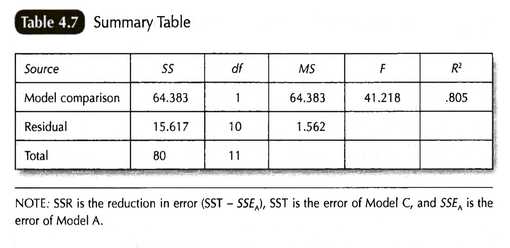
```

.text_90[

- Mientras más grande sea F, esto significa que hay más varianza explicada, que varianza por explicar.
- La distribución muestral F (i.e., la forma que sigue la distribución) es asimétrica positiva.
  + Esto quiere decir que, a mayores valores de F, uno espera que las chances de observar valores F de gran tamaño sea muy pequeña. Si nuestro valor F observado posee chances menores a %5 (por ejemplo), es convencional afirmar que nuestros resultados estan por sobre el azar.
  + En otras palabras, que nuestra distribucion de F, en muy pocas ocasiones genera nuestros datos observados. Y por tanto, podemos rechazar la hipotesis nula (ver Huck, 2012).
  + Con lo anterior, planteamos que nuestro modelo ajusta a los datos con tal o cual R2.

  ]
]

---


class: middle, inverse

background-image: url(img/background_02.jpeg)
background-size: 100%


.line_space_01[
Taller
]
.line_space_01[
.text_250[
.bold_white[
Comparación de modelos
]
]
]
.line_space_01[
Reajustemos los modelos
]


<br>
<br>

---

background-image: url(img/background_03.jpeg)
background-size: 100%


.pull_l_50_t_090[

### Abrir y preparar datos

```{r , echo=TRUE, eval=FALSE}

#------------------------------------------------------------------------------
# datos
#------------------------------------------------------------------------------

#----------------------------------------------------------
# tabla 3.2
#----------------------------------------------------------

data_table_3_2 <- read.table(
text="
person   y    x    x_q   xy   z
1        2    8     64   16   1
2        3    9     81   27   2
3        3    9     81   27   1
4        4   10    100   40   2
5        7    6     36   42   1
6        5    7     49   35   2
7        5    4     16   20   1
8        7    5     25   35   2
9        8    3      9   24   1
10       9    1      1    9   2
11       9    2      4   18   1
12      10    2      4   20   2

",
header=TRUE, stringsAsFactors = FALSE)

# Nota: agregamos a la variable z,
#       para ilustrar como se ve un
#       modelo que no explica a y.

#----------------------------------------------------------
# preparar datos
#----------------------------------------------------------

data_model <- data_table_3_2 %>%
              mutate(x_g = mean(x, na.rm = TRUE)) %>%
              mutate(x_cgm = x - x_g) %>%
              dplyr::select(y, x, x_cgm, z)


```

]

.pull_r_50_t_090[

### Ajustar modelos

```{r , echo=TRUE, eval=FALSE}

#------------------------------------------------------------------------------
# datos
#------------------------------------------------------------------------------

#--------------------------------------
# formulas
#--------------------------------------

f00 <- as.formula(y ~ + 1)
f01 <- as.formula(y ~ + 1 + x)
f02 <- as.formula(y ~ + 1 + x_cgm)
f03 <- as.formula(y ~ + 1 + z)

#--------------------------------------
# ajustar modelos
#--------------------------------------

m00 <- lm(f00, data = data_model)
m01 <- lm(f01, data = data_model)
m02 <- lm(f02, data = data_model)
m03 <- lm(f03, data = data_model)

#--------------------------------------
# comparar modelos de forma sintética
#--------------------------------------

texreg::screenreg(
    list(m00, m01, m02, m03),
    star.symbol = "*", 
    center = TRUE, 
    doctype = FALSE,
    dcolumn = TRUE, 
    booktabs = TRUE,
    single.row = FALSE
    )


```

]

---

background-image: url(img/background_03.jpeg)
background-size: 100%


.pull_l_50_t_100[

### Ajustar modelos

```{r , echo=TRUE, eval=FALSE}

#------------------------------------------------------------------------------
# datos
#------------------------------------------------------------------------------

#--------------------------------------
# formulas
#--------------------------------------

f00 <- as.formula(y ~ + 1)
f01 <- as.formula(y ~ + 1 + x)
f02 <- as.formula(y ~ + 1 + x_cgm)
f03 <- as.formula(y ~ + 1 + z)

#--------------------------------------
# ajustar modelos
#--------------------------------------

m00 <- lm(f00, data = data_model)
m01 <- lm(f01, data = data_model)
m02 <- lm(f02, data = data_model)
m03 <- lm(f03, data = data_model)

#--------------------------------------
# comparar modelos de forma sintética
#--------------------------------------

texreg::screenreg(
    list(m00, m01, m02, m03),
    star.symbol = "*", 
    center = TRUE, 
    doctype = FALSE,
    dcolumn = TRUE, 
    booktabs = TRUE,
    single.row = FALSE
    )


```

]

.pull_r_50_t_100[

### Resultados de los modelos

```text

=====================================================
             Model 1    Model 2    Model 3    Model 4
-----------------------------------------------------
(Intercept)   6.00 ***  10.27 ***   6.00 ***   5.00  
             (0.78)     (0.76)     (0.36)     (2.56) 
x                       -0.78 ***                    
                        (0.12)                       
x_cgm                              -0.78 ***         
                                   (0.12)            
z                                              0.67   
                                              (1.62) 
-----------------------------------------------------
R^2           0.00       0.80       0.80       0.02  
Adj. R^2      0.00       0.79       0.79      -0.08  
Num. obs.    12         12         12         12     
=====================================================
 *** p < 0.001; ** p < 0.01; * p < 0.05


```
<br>

El modelo 3 de la tabla anterior, llamado `m02` en nuestro código, es nuestro modelo de interes. Este fue ajustado con la formula `y ~ + 1 + x_cgm`. En la siguiente lámina vamos a aplicar la prueba de ANOVA o prueba F, para realizar una evaluación global.

]

---

background-image: url(img/background_03.jpeg)
background-size: 100%

.pull_l_50_t_100[

### Evaluación Global del Modelo

```{r , echo=TRUE, eval=FALSE}

#----------------------------------------------------------
# tabla 4.7 evaluación global
#----------------------------------------------------------

# tabla F de modelo aumentado
anova(m02)

# R2 del modelo
summary(m02)$r.squared


```

```text
# tabla F de modelo aumentado
> anova(m02)
Analysis of Variance Table

Response: y
          Df Sum Sq Mean Sq F value     Pr(>F)    
x_cgm      1 64.383  64.383  41.227 0.00007627 ***
Residuals 10 15.617   1.562                       
---
Signif. codes:  0 ‘***’ 0.001 ‘**’ 0.01 ‘*’ 0.05 ‘.’ 0.1 ‘ ’ 1
> 
> # R2 del modelo
> summary(m02)$r.squared
[1] 0.8047897

```

]


.pull_r_50_t_100[

### Tabla 4.7

```{r echo=FALSE, out.width = '100%', retina = 1}

```


]


---

background-image: url(img/background_03.jpeg)
background-size: 100%

.pull_l_50_t_100[

### Comparación entre Modelos

```{r , echo=TRUE, eval=FALSE}

#----------------------------------------------------------
# tabla 4.7 comparación de modelos (Vik, 2014, p50)
#----------------------------------------------------------

# tabla F de la comparación de modelos

anova(m00, m02)

# R2 del modelo
summary(m02)$r.squared


```

```text
# tabla F de modelo aumentado
>anova(m00,  m02)
Analysis of Variance Table

Model 1: y ~ +1
Model 2: y ~ +1 + x_cgm
  Res.Df    RSS Df Sum of Sq      F     Pr(>F)    
1     11 80.000                                   
2     10 15.617  1    64.383 41.227 0.00007627 ***
---
Signif. codes:  0 ‘***’ 0.001 ‘**’ 0.01 ‘*’ 0.05 ‘.’ 0.1 ‘ ’ 1
> 
> # R2 del modelo
> summary(m02)$r.squared
[1] 0.8047897

```

]


.pull_r_50_t_100[

### Tabla 4.7

```{r echo=FALSE, out.width = '100%', retina = 1}

```


]


---


class: middle, inverse

background-image: url(img/background_02.jpeg)
background-size: 100%


.line_space_01[
Taller
]
.line_space_01[
.text_250[
.bold_white[
Evaluación Global
]
]
]
.line_space_01[
Donde se encuentra cada componente en el output de R
]


<br>
<br>

---

### Evaluación Global

```{r echo=FALSE, out.width = '100%', retina = 1}
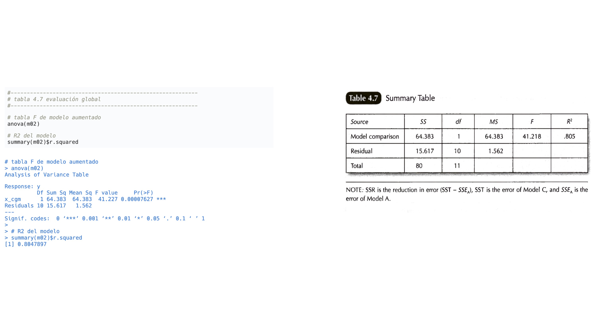
```

---
### Evaluación Global

```{r echo=FALSE, out.width = '100%', retina = 1}
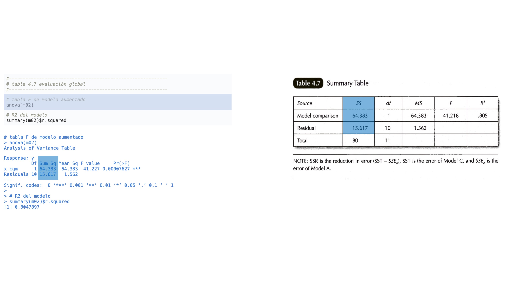
```

---

### Evaluación Global

```{r echo=FALSE, out.width = '100%', retina = 1}
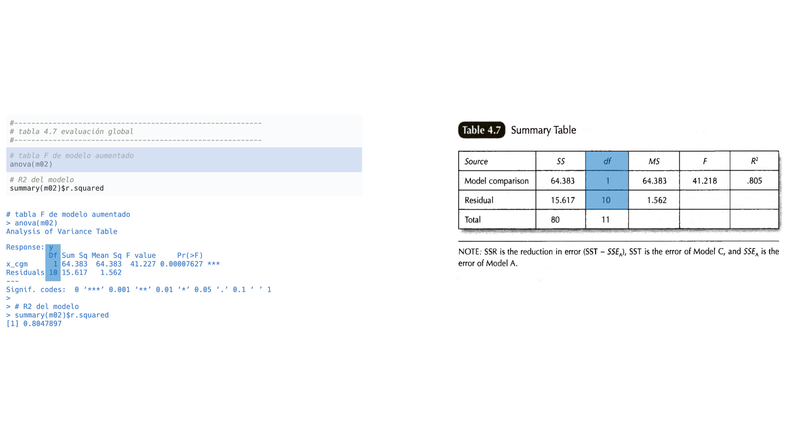
```

---

### Evaluación Global

```{r echo=FALSE, out.width = '100%', retina = 1}
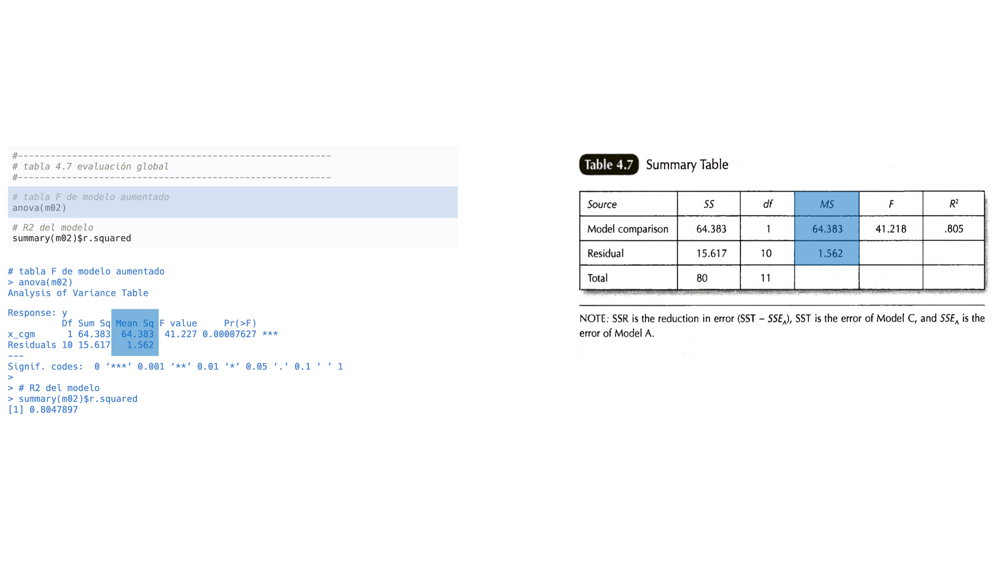
```

---

### Evaluación Global

```{r echo=FALSE, out.width = '100%', retina = 1}
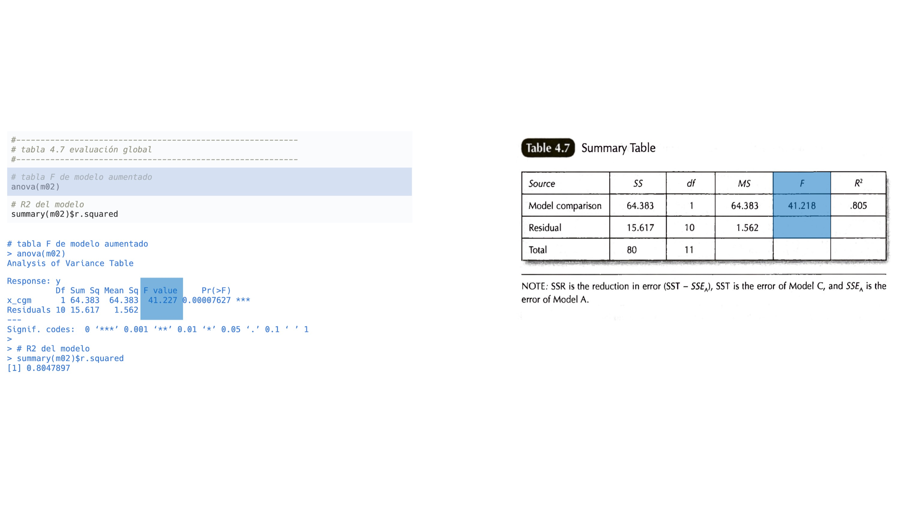
```

---


### Evaluación Global

```{r echo=FALSE, out.width = '100%', retina = 1}
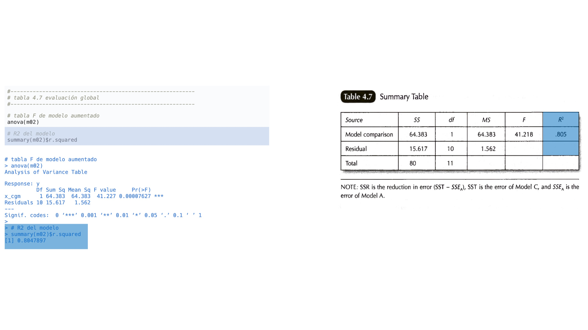
```


---
### Comparación de modelos

```{r echo=FALSE, out.width = '100%', retina = 1}
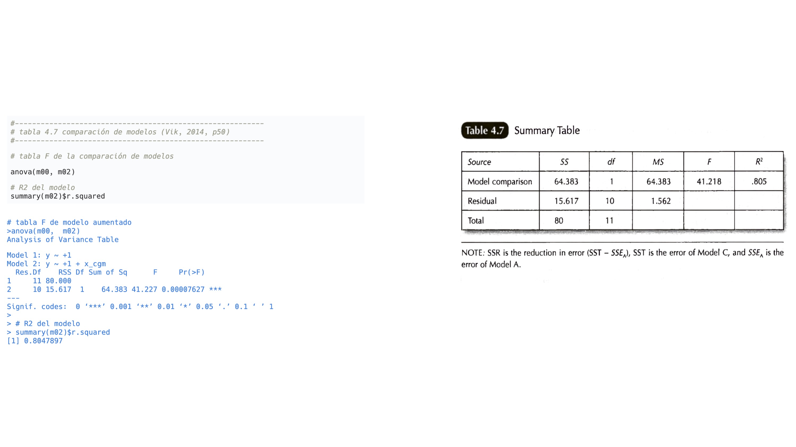
```


---


class: middle, inverse

background-image: url(img/background_02.jpeg)
background-size: 100%


.line_space_01[
Taller
]
.line_space_01[
.text_250[
.bold_white[
Comparación de Modelos
]
]
]
.line_space_01[
Donde se encuentra cada componente en el output de R
]


<br>
<br>

---
### Comparación de modelos

```{r echo=FALSE, out.width = '100%', retina = 1}
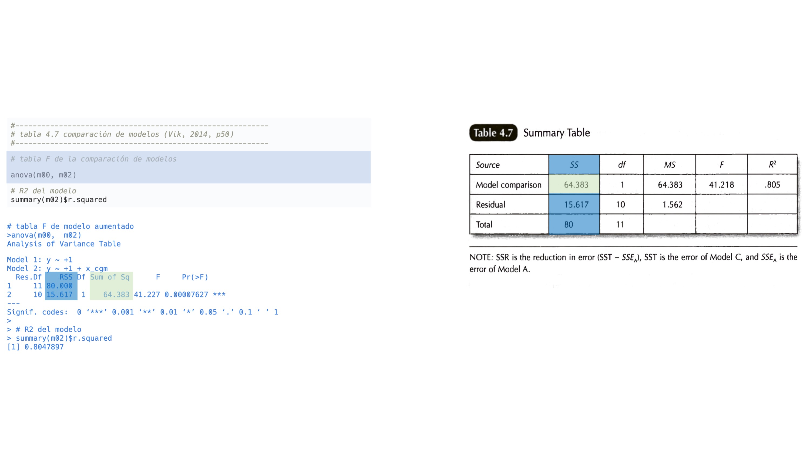
```

---

### Comparación de modelos

```{r echo=FALSE, out.width = '100%', retina = 1}
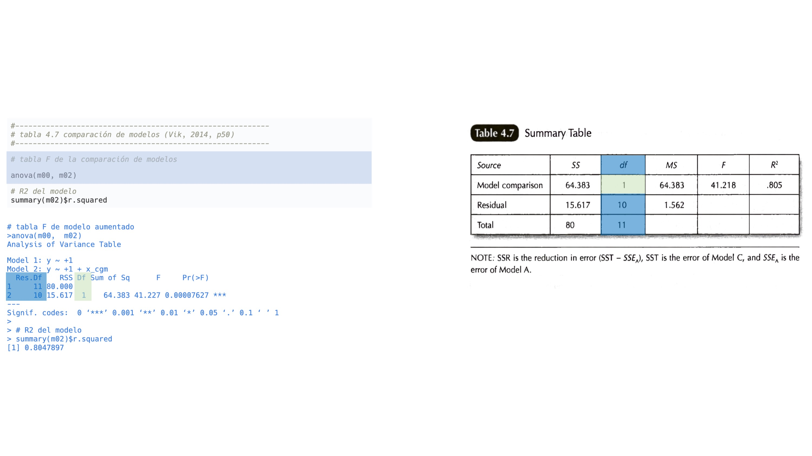
```

---

### Comparación de modelos

```{r echo=FALSE, out.width = '100%', retina = 1}
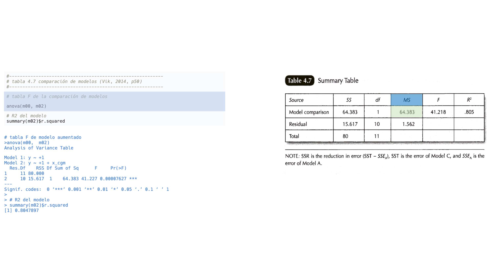
```

---

### Comparación de modelos

```{r echo=FALSE, out.width = '100%', retina = 1}
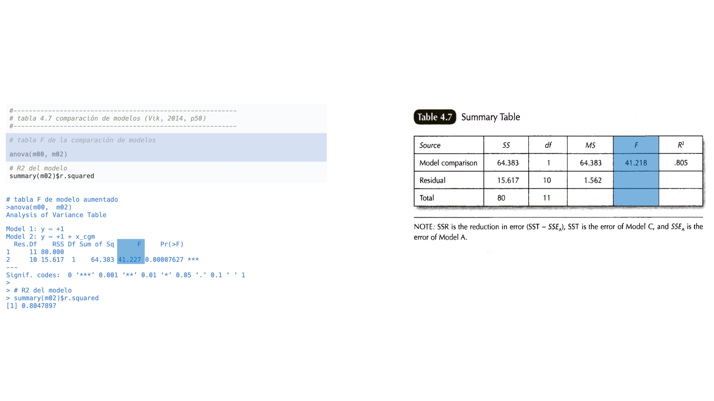
```

---


### Comparación de modelos

```{r echo=FALSE, out.width = '100%', retina = 1}

```

---


class: middle, inverse

background-image: url(img/background_02.jpeg)
background-size: 100%


.line_space_01[
Taller
]
.line_space_01[
.text_250[
.bold_white[
¿Qué tan típico es nuestro modelo?
]
]
]
.line_space_01[
Cuáles son las chances de los resultados que estamos observando
]


<br>
<br>

---

background-image: url(img/background_03.jpeg)
background-size: 100%


.pull_l_40[

.text_80[
```{r , echo=TRUE, eval=FALSE}

#------------------------------------------------------------------------------
# p value de la comparación modelos (m00, m02)
#------------------------------------------------------------------------------

# opciones de consola
options(scipen = 999)
options(digits = 7)

# valor p de la comparación de modelos
anova(m00, m02) %>%
broom::tidy() %>%
knitr::kable(., digits = 7)

# -----------------------------------------------
# f value
# -----------------------------------------------

f_value <- anova(m00, m02) %>%
           broom::tidy() %>%
           mutate(model = c('compact', 'augmented')) %>%
           dplyr::filter(model == 'augmented') %>%
           dplyr::select(statistic) %>%
           pull() %>%
           as.numeric()

# -----------------------------------------------
# p value
# -----------------------------------------------

df_1 <- 1  # cantidad de parámetros fijos del modelo
df_2 <- 10 # grados de libertad restantes (n_total - df_1 - 1)

pf(f_value, df1 = df_1, df2 = df_2, lower.tail = FALSE)

# -----------------------------------------------
# f critic
# -----------------------------------------------

f_critic <- qf(.975, df1 = df_1, df2 = df_2)

# -----------------------------------------------
# visualization
# -----------------------------------------------

library(ggplot2)
f_m02 <-  ggplot(data.frame(x = c(0, 50)), aes(x)) +
  stat_function(fun = df, args = list(df1 = df_1, df2 = df_2), geom = "area") +
  geom_vline(xintercept = f_value, color = 'red') +
  geom_vline(xintercept = f_critic, color = 'red', linetype = 'dotted') +
  scale_x_continuous(breaks=seq(0, 50, 1)) + 
  # xlim(0,10) +
  ylim(0,1) +
  labs(
    x = 'F Ratio', 
    y = 'density') +
  theme_minimal() +
  theme(
  panel.background = element_blank(),
  panel.grid.minor = element_blank(),
  panel.grid.major = element_blank(),
  axis.text.x=element_text(size=1)
  )

# show plot
f_m02

```

  ]
]

.pull_r_60[

```{r , echo=FALSE, eval=TRUE, out.width = '90%', retina = 1}

f_m02

```

.text_60[
Nota: distrubición de estadístico F. Línea roja es nuestro F observado.
]

]

---


class: middle, inverse

background-image: url(img/background_02.jpeg)
background-size: 100%


.line_space_01[
Taller
]
.line_space_01[
.text_250[
.bold_white[
Modelo no predictivo
]
]
]
.line_space_01[
Cuáles son las chances de un modelo que no ajusta
]


<br>
<br>

---

background-image: url(img/background_03.jpeg)
background-size: 100%


.pull_l_40[

.text_80[
```{r , echo=TRUE, eval=FALSE}

#------------------------------------------------------------------------------
# p value de la comparación modelos (m00, m03)
#------------------------------------------------------------------------------

# opciones de consola
options(scipen = 999)
options(digits = 7)

# valor p de la comparación de modelos
anova(m00, m03) %>%
broom::tidy() %>%
knitr::kable(., digits = 7)

# -----------------------------------------------
# f value
# -----------------------------------------------

f_value_null <- anova(m00, m03) %>%
                broom::tidy() %>%
                mutate(model = c('compact', 'augmented')) %>%
                dplyr::filter(model == 'augmented') %>%
                dplyr::select(statistic) %>%
                pull() %>%
                as.numeric()

# -----------------------------------------------
# p value
# -----------------------------------------------

df_1 <- 1  # cantidad de parámetros fijos del modelo
df_2 <- 10 # grados de libertad restantes (n_total - df_1 - 1)

pf(f_value_null, df1 = df_1, df2 = df_2, lower.tail = FALSE) %>%
r4sda::decimal(., 7)


# -----------------------------------------------
# f critic
# -----------------------------------------------

f_critic <- qf(.975, df1 = df_1, df2 = df_2)

# -----------------------------------------------
# visualization
# -----------------------------------------------

library(ggplot2)
f_m03 <- ggplot(data.frame(x = c(0, 50)), aes(x)) +
  stat_function(fun = df, args = list(df1 = df_1, df2 = df_2), geom = "area") +
  geom_vline(xintercept = f_value_null, color = 'red') +
  geom_vline(xintercept = f_critic, color = 'red', linetype = 'dotted') +
  scale_x_continuous(breaks=seq(0, 50, 1)) + 
  # xlim(0,10) +
  ylim(0,1) +
  labs(
    x = 'F Ratio', 
    y = 'density') +
  theme_minimal() +
  theme(
  panel.background = element_blank(),
  panel.grid.minor = element_blank(),
  panel.grid.major = element_blank(),
  axis.text.x=element_text(size=1)
  )


# show plot
f_m03

```

  ]
]

.pull_r_60[

```{r , echo=FALSE, eval=TRUE, out.width = '90%', retina = 1}

f_m03

```

.text_60[
Nota: distrubición de estadístico F. Línea roja es nuestro F del modelo m03.
]

]


.pull_l_50[

#### Modelo de interés `m02`

```{r , echo=FALSE, eval=TRUE, out.width = '95%', retina = 1}

f_m02

```

.text_60[
Nota: distrubición de estadístico F. Línea roja es nuestro F observado.
]

]

.pull_r_50[

#### Modelo no predictivo `m03`

```{r , echo=FALSE, eval=TRUE, out.width = '95%', retina = 1}

f_m03

```

.text_60[
Nota: distrubición de estadístico F. Línea roja es nuestro F del modelo m03.
]

]

---


class: middle, inverse

background-image: url(img/background_02.jpeg)
background-size: 100%


.line_space_01[
Taller
]
.line_space_01[
.text_250[
.bold_white[
Correlaciones
]
]
]
.line_space_01[
Cuáles son las chances de un modelo que no ajusta
]


<br>
<br>

---

#### Correlaciones esperadas

```{r echo=FALSE, out.width = '35%', retina = 1}
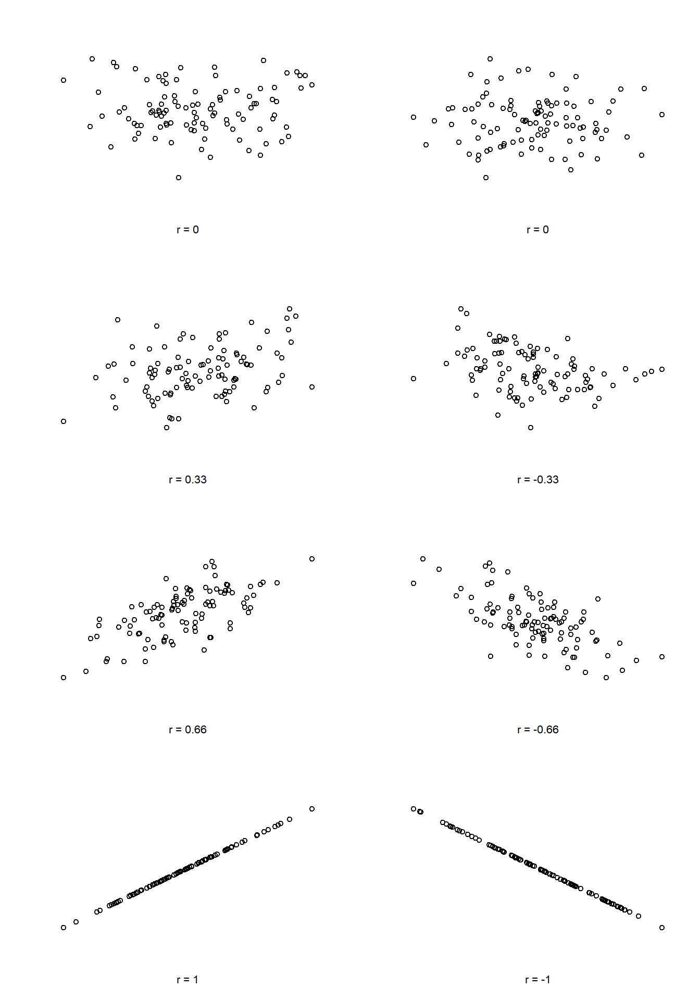
```

.right[
.text_60[
Referencias: Navarro (2019)
  ]

  ]

]

---

#### Correlaciones no esperadas

```{r echo=FALSE, out.width = '60%', retina = 1}
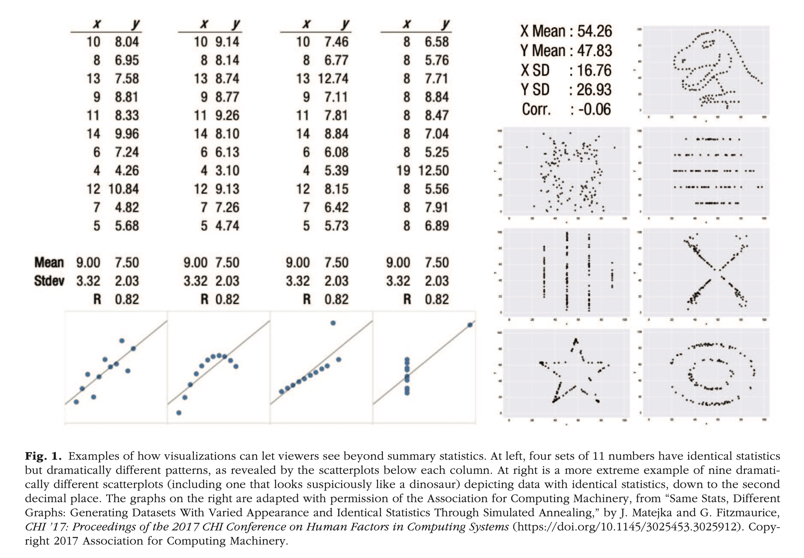
```

.right[
.text_60[
Referencias: Franconeri et al. (2021)
  ]

  ]

]

---

background-image: url(img/background_03.jpeg)
background-size: 100%


.pull_l_50_t_080[

#### Correlaciones

```{r , echo=TRUE, eval=FALSE}

#------------------------------------------------------------------------------
# datos
#------------------------------------------------------------------------------

#----------------------------------------------------------
# tabla 3.2
#----------------------------------------------------------

data_table_3_2 <- read.table(
text="
person   y    x    x_q   xy   z
1        2    8     64   16   1
2        3    9     81   27   2
3        3    9     81   27   1
4        4   10    100   40   2
5        7    6     36   42   1
6        5    7     49   35   2
7        5    4     16   20   1
8        7    5     25   35   2
9        8    3      9   24   1
10       9    1      1    9   2
11       9    2      4   18   1
12      10    2      4   20   2

",
header=TRUE, stringsAsFactors = FALSE)

# Nota: agregamos a la variable z,
#       para ilustrar como se ve un
#       modelo que no explica a y.

#----------------------------------------------------------
# preparar datos
#----------------------------------------------------------

library(dplyr)
data_model <- data_table_3_2 %>%
              mutate(x_g = mean(x, na.rm = TRUE)) %>%
              mutate(x_cgm = x - x_g) %>%
              dplyr::select(y, x, x_cgm, z)


#----------------------------------------------------------
# correlación base::cor
#----------------------------------------------------------

cor(data_model$y, data_model$x)

#----------------------------------------------------------
# correlación base::cor.test
#----------------------------------------------------------

cor.test(data_model$y, data_model$x)


```

]

.pull_r_50_t_080[

#### Output

```text
> #----------------------------------------------------------
> # tabla 3.2
> #----------------------------------------------------------
> 
> data_table_3_2 <- read.table(
+ text="
+ person   y    x    x_q   xy   z
+ 1        2    8     64   16   1
+ 2        3    9     81   27   2
+ 3        3    9     81   27   1
+ 4        4   10    100   40   2
+ 5        7    6     36   42   1
+ 6        5    7     49   35   2
+ 7        5    4     16   20   1
+ 8        7    5     25   35   2
+ 9        8    3      9   24   1
+ 10       9    1      1    9   2
+ 11       9    2      4   18   1
+ 12      10    2      4   20   2
+ 
+ ",
+ header=TRUE, stringsAsFactors = FALSE)
> 
> # Nota: agregamos a la variable z,
> #       para ilustrar como se ve un
> #       modelo que no explica a y.
> 
> #----------------------------------------------------------
> # preparar datos
> #----------------------------------------------------------
> 
> library(dplyr)
> data_model <- data_table_3_2 %>%
+               mutate(x_g = mean(x, na.rm = TRUE)) %>%
+               mutate(x_cgm = x - x_g) %>%
+               dplyr::select(y, x, x_cgm, z)
> 
> 
> #----------------------------------------------------------
> # correlación base::cor
> #----------------------------------------------------------
> 
> cor(data_model$y, data_model$x)
[1] -0.8971007
> 
> #----------------------------------------------------------
> # correlación base::cor.test
> #----------------------------------------------------------
> 
> cor.test(data_model$y, data_model$x)

  Pearson's product-moment correlation

data:  data_model$y and data_model$x
t = -6.4208, df = 10, p-value = 7.627e-05
alternative hypothesis: true correlation is not equal to 0
95 percent confidence interval:
 -0.9710564 -0.6661805
sample estimates:
       cor 
-0.8971007 


```

]


---

background-image: url(img/background_03.jpeg)
background-size: 100%


.pull_l_50_t_080[

#### Diagonal inferior de correlaciones

```{r , echo=TRUE, eval=FALSE}

#------------------------------------------------------------------------------
# datos
#------------------------------------------------------------------------------

#----------------------------------------------------------
# tabla 3.2
#----------------------------------------------------------

data_table_3_2 <- read.table(
text="
person   y    x    x_q   xy   z
1        2    8     64   16   1
2        3    9     81   27   2
3        3    9     81   27   1
4        4   10    100   40   2
5        7    6     36   42   1
6        5    7     49   35   2
7        5    4     16   20   1
8        7    5     25   35   2
9        8    3      9   24   1
10       9    1      1    9   2
11       9    2      4   18   1
12      10    2      4   20   2

",
header=TRUE, stringsAsFactors = FALSE)

# Nota: agregamos a la variable z,
#       para ilustrar como se ve un
#       modelo que no explica a y.

#----------------------------------------------------------
# preparar datos
#----------------------------------------------------------

library(dplyr)
data_model <- data_table_3_2 %>%
              mutate(x_g = mean(x, na.rm = TRUE)) %>%
              mutate(x_cgm = x - x_g) %>%
              dplyr::select(y, x, x_cgm, z)

#----------------------------------------------------------
# con corrr::correlate
#----------------------------------------------------------

data_model %>%
corrr::correlate() %>%
corrr::shave()  %>%
corrr::fashion()

```

]

.pull_r_50_t_080[

#### Output

```text

> #------------------------------------------------------------------------------
> # datos
> #------------------------------------------------------------------------------
> 
> #----------------------------------------------------------
> # tabla 3.2
> #----------------------------------------------------------
> 
> data_table_3_2 <- read.table(
+ text="
+ person   y    x    x_q   xy   z
+ 1        2    8     64   16   1
+ 2        3    9     81   27   2
+ 3        3    9     81   27   1
+ 4        4   10    100   40   2
+ 5        7    6     36   42   1
+ 6        5    7     49   35   2
+ 7        5    4     16   20   1
+ 8        7    5     25   35   2
+ 9        8    3      9   24   1
+ 10       9    1      1    9   2
+ 11       9    2      4   18   1
+ 12      10    2      4   20   2
+ 
+ ",
+ header=TRUE, stringsAsFactors = FALSE)
> 
> # Nota: agregamos a la variable z,
> #       para ilustrar como se ve un
> #       modelo que no explica a y.
> 
> #----------------------------------------------------------
> # preparar datos
> #----------------------------------------------------------
> 
> library(dplyr)
> data_model <- data_table_3_2 %>%
+               mutate(x_g = mean(x, na.rm = TRUE)) %>%
+               mutate(x_cgm = x - x_g) %>%
+               dplyr::select(y, x, x_cgm, z)
> 
> #----------------------------------------------------------
> # con corrr::correlate
> #----------------------------------------------------------
> 
> data_model %>%
+ corrr::correlate() %>%
+ corrr::shave()  %>%
+ corrr::fashion()

Correlation method: 'pearson'
Missing treated using: 'pairwise.complete.obs'

   term    y    x x_cgm z
1     y                  
2     x -.90             
3 x_cgm -.90 1.00        
4     z  .13  .06   .06  

```

]

---


class: inverse split-two


background-image: url(img/background_02.jpeg)
background-size: 100%


.column[
.pull_l_50_1[

.text_180[
.bold_white[
<br>
Muchas gracias!
    ]
  ]
]

.pull_l_50_2[
.line_space_03[
.text_60[

*Carrasco, D., PhD*

*Centro de Medición MIDE UC,*

*Pontificia Universidad Católica de Chile*

https://dacarras.github.io/
    ]
    ]
  ]
]


.column[

.text_180[
.bold_white[
<br>
Referencias
  ]
]

.text_80[
.french[


Franconeri, S. L., Padilla, L. M., Shah, P., Zacks, J. M., & Hullman, J. (2021). The Science of Visual Data Communication: What Works. Psychological Science in the Public Interest, 22(3), 110–161. https://doi.org/10.1177/15291006211051956

Huck, S. W. (2012). Bivariate, Multiple, and Logistic Regression. In Reading Statistics and Research (6th ed., pp. 367–403). Pearson Education.

Navarro, D. (2013). Learning statistics with R: A tutorial for psychology students and other beginners.

Vik, P. (2014). Regression, ANOVA, and the general linear model: A statistics primer. Sage.


  ] 
 ]
]


