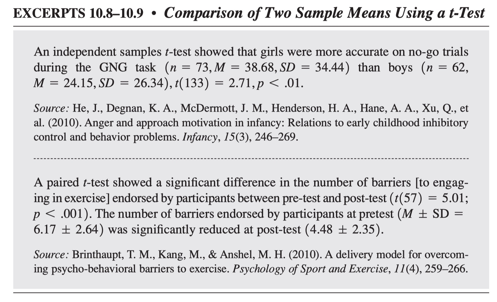
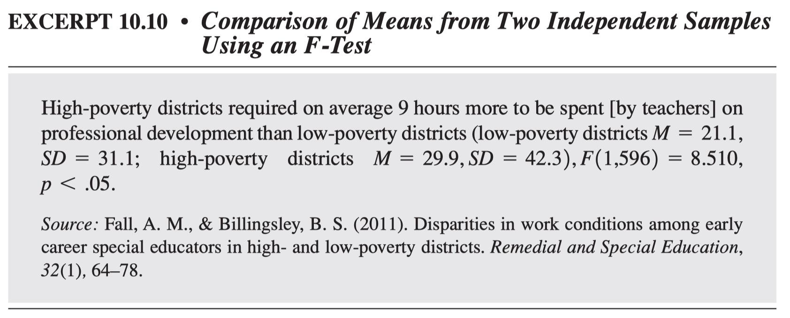

<style>
  .main-container {
    max-width: 1600px !important;
  }
  .list-group-item.active, 
  .list-group-item.active:focus, 
  .list-group-item.active:hover {
    background-color: #373334;
  }
</style>


```{r setup, include=FALSE}
#--------------------------------------
# setup
#--------------------------------------

# knitr option
knitr::opts_chunk$set(dev = 'png')
options(knitr.kable.NA = '')
options(digits = 7)
options(scipen = 999999)

# remove all previous objects
rm(list = ls())

# fonts
Sys.setenv(LANG="en_US.UTF-8")


```

# Taller 3: Prueba t y ANOVA

## Cargar datos

```{r , echo=TRUE, warning=FALSE}

#----------------------------------------------------------
# cargar datos
#----------------------------------------------------------

#--------------------------------------
# cargar dplyr
#--------------------------------------

library(dplyr)

#--------------------------------------
# datos Vik (2014, p83)
#--------------------------------------

table_7_1 <- read.table(text = "
subject   score    group       dummy
      1       3    'No Dx'        -1
      2       5    'No Dx'        -1
      3       6    'No Dx'        -1
      4       8    'No Dx'        -1
      5       9    'No Dx'        -1
      6      11    'No Dx'        -1
      7      19    'Depressed'     1
      8      15    'Depressed'     1
      9      16    'Depressed'     1
     10      16    'Depressed'     1
     11      19    'Depressed'     1
     12      17    'Depressed'     1
     13       3    'No Dx'        -1
     14       5    'No Dx'        -1
     15       4    'No Dx'        -1
     16       6    'No Dx'        -1
     17       8    'No Dx'        -1
     18      10    'No Dx'        -1
     19      24    'Depressed'     1
     20      24    'Depressed'     1
     21      22    'Depressed'     1
     22      23    'Depressed'     1
     23      19    'Depressed'     1
     24      20    'Depressed'     1

", header = TRUE, stringsAsFactors = FALSE)

# --------------------------------------
# variables
#--------------------------------------

# score = puntaje de sintomas
# group = grupo diagnosticado (Depressed), 
#         y grupo no diagnosticado (No Dx)

```


# Prueba t

```{r , echo=TRUE, warning=FALSE}

#----------------------------------------------------------
# prueba t
#----------------------------------------------------------

#--------------------------------------
# definir digitos de consola
#--------------------------------------

options(scipen = 999)
options(digits = 10)

#--------------------------------------
# aplicar prueba t
#--------------------------------------

t.test(score ~ group, var.equal=TRUE, data = table_7_1)

# Nota: asumiendo varianzas equivalentes.
#       R por defecto asume varianzas no equivalentes
#       y aplica la corrección de Welch.
#       El argumento `var.equal=TRUE`, aplica
#       la forma más convencional de t-test.

#--------------------------------------
# tabla de medias
#--------------------------------------

table_7_1 %>%
group_by(group) %>%
summarize(
  mean = mean(score, na.rm = TRUE),
  sd = sd(score, na.rm = TRUE),
  n = n()
  ) %>%
knitr::kable(., digits = 2)


#--------------------------------------
# tamaño de efecto (Cohen's d)
#--------------------------------------

table_7_1 %>%
rstatix::cohens_d(score ~ group, var.equal = TRUE)

#--------------------------------------
# tamaño de efecto (Cohen's d, con corrección de Hedges)
#--------------------------------------

table_7_1 %>%
rstatix::cohens_d(score ~ group, 
  var.equal = TRUE,
  hedges.correction = TRUE
  )

# Nota: debido a que la diferencia entre el tamaño
#       de efecto de "d" (Cohen), no es muy diferente a "g" (Hedges)
#       se reporta "d". Para mas detalles de cada tamao de efecto ver
#       Borenstein et al., (2009)

```


## Modelo de descripción de resultados



>Nota: Huck (2012, p214)

## Descripción de resultados

Se aplicó una prueba t de muestras independientes, para comparar las medias de los puntajes de sintomas depresivos, entre pacientes diagnosticados de depresión, y pacientes sin diagnostico. Los resultados indican que los pacientes diagnosticados presentan medias más altas de sintomas depresivos (M = 19.5, DS = 3.18, n = 12) que los pacientes no diagnosticados (M = 6.5, DS = 2.68, n = 12), t(22) = 10.84, p <.001. La diferencia de medias observadas, es de gran tamaño (Cohen's d = 4.42).


# ANOVA

```{r , echo=TRUE, warning=FALSE}

#----------------------------------------------------------
# prueba F
#----------------------------------------------------------

#--------------------------------------
# definir digitos de consola
#--------------------------------------

options(scipen = 999)
options(digits = 10)

#--------------------------------------
# ANOVA
#--------------------------------------

aov(score ~ dummy, data = table_7_1) %>%
broom::tidy() %>%
knitr::kable(., digits = 3)

#--------------------------------------
# tabla de medias
#--------------------------------------

table_7_1 %>%
group_by(group) %>%
summarize(
  mean = mean(score, na.rm = TRUE),
  sd = sd(score, na.rm = TRUE),
  n = n()
  ) %>%
knitr::kable(., digits = 2)


#--------------------------------------
# tamaño de efecto (eta squared)
#--------------------------------------

table_7_1 %>%
aov(score ~ dummy, data = .) %>%
rstatix::eta_squared()

#--------------------------------------
# tamaño de efecto (partial eta squared)
#--------------------------------------

table_7_1 %>%
aov(score ~ dummy, data = .) %>%
rstatix::partial_eta_squared()


# Nota: eta squared es util para comparacion 
#       entre factores de un mismo estudio.
#       partial eta squared es recomdado para 
#       la comparación de estudios entre sí
#       (i.e. meta análisis) (ver Lakens, 2013).
#       De esta forma se reporta esta última cifra.

#--------------------------------------
# tamaño de efecto en regresión
#--------------------------------------

broom::glance(
  lm(score ~ dummy, data = table_7_1)
  ) %>%
knitr::kable(., digits = 2)

```

## Modelo de descripción de resultados



>Nota: Huck (2012, p215)

## Descripción de resultados

Aplicamos una prueba f, para comparar las medias de los puntajes de sintomas depresivos, entre pacientes diagnosticados de depresión, y pacientes sin diagnostico. Los resultados indican que los pacientes diagnosticados presentan medias más altas de sintomas depresivos (M = 19.5, DS = 3.18, n = 12) que los pacientes no diagnosticados (M = 6.5, DS = 2.68, n = 12), F(1, 22) = 117.41, p <.001. La diferencia de medias observadas es de gran tamaño ( $\eta_{p}^2$ = .84 ).

# Relacion entre t y F

```{r , echo=TRUE, warning=FALSE}

#----------------------------------------------------------
# relacion entre t y F
#----------------------------------------------------------

#--------------------------------------
# aplicar prueba t
#--------------------------------------

t_test <- t.test(score ~ group, var.equal=TRUE, data = table_7_1)

broom::tidy(t_test)

t_value <- broom::tidy(t_test) %>%
           dplyr::select(statistic) %>%
           dplyr::pull()

#--------------------------------------
# ANOVA
#--------------------------------------

f_test <- aov(score ~ dummy, data = table_7_1)

broom::tidy(f_test)

f_value <- broom::tidy(f_test) %>%
           dplyr::filter(term == 'dummy') %>%
           dplyr::select(statistic) %>%
           dplyr::pull()

#--------------------------------------
# comparar ambos valores
#--------------------------------------

t_value^2
f_value

# Nota: ambos valores son equivalentes.

```


# Códigos útiles para la guía

## Abrir datos

```{r , echo=TRUE, warning=FALSE}

#----------------------------------------------------------
# abrir datos
#----------------------------------------------------------

#--------------------------------------
# abrir desde url
#--------------------------------------

datos_ipip <- read.csv2(
              url(
                'https://raw.githubusercontent.com/dacarras/psi4035_examples/master/guias/personalidad.csv'
                )
              )

# Nota: read.csv es para datos separados por ","
#       read.csv2 es para datos separados por ";"

#--------------------------------------
# inspeccionar datos
#--------------------------------------

dplyr::glimpse(datos_ipip)


```

## Preparar datos

- R es "case sensitive"
- Mayusculas y minusculas son in interpretadas como cosas diferentes
- Por convención, emplearemos datos en minuscula para simplificar la generación de códigos

```{r , echo=TRUE, warning=FALSE}

#----------------------------------------------------------
# preparar datos
#----------------------------------------------------------

#--------------------------------------
# minusculas
#--------------------------------------

library(dplyr)
data_model <- datos_ipip %>%
              tibble::as_tibble() %>%
              rename_all(tolower)

```


## Crear libro de códigos

```{r , echo=TRUE, warning=FALSE}

#----------------------------------------------------------
# libro de codigos
#----------------------------------------------------------

#--------------------------------------
# listado de variables
#--------------------------------------

variable_scores <- read.table(text ="
variable  item_text repsonse_categories score
rses01  'I feel that I’m a person of worth, at least on an equal plane with others' '1 =tot. disagree; 7 = tot. agree'  self-esteem
rses02  'I feel that I have a number of good qualities' '1 =tot. disagree; 7 = tot. agree'  self-esteem
rses03  'All in all, I am inclined to feel that I am a failure (recoded).'  '1 =tot. disagree; 7 = tot. agree'  self-esteem
rses04  'I am able to do things as well as most other people' '1 =tot. disagree; 7 = tot. agree'  self-esteem
rses05  'I feel I do not have much to be proud of (recoded).' '1 =tot. disagree; 7 = tot. agree'  self-esteem
rses06  'I take a positive attitude towards myself' '1 =tot. disagree; 7 = tot. agree'  self-esteem
rses07  'On the whole, I am satisfied with myself'  '1 =tot. disagree; 7 = tot. agree'  self-esteem
rses08  'I wish I could have more respect for myself (recoded).'  '1 =tot. disagree; 7 = tot. agree'  self-esteem
rses09  'I certainly feel useless at times (recoded).'  '1 =tot. disagree; 7 = tot. agree'  self-esteem
rses10  'At times, I think I am no good at all (recoded).'  '1 =tot. disagree; 7 = tot. agree'  self-esteem
ex01  'Am the life of the party.' '1 = very unacurate; 5 = very acurate'  extraversion
ex02  'Don’t talk a lot (recoded).' '1 = very unacurate; 5 = very acurate'  extraversion
ex03  'Feel comfortable around people.' '1 = very unacurate; 5 = very acurate'  extraversion
ex04  'Keep in the background (recoded).' '1 = very unacurate; 5 = very acurate'  extraversion
ex05  'Start conversations.'  '1 = very unacurate; 5 = very acurate'  extraversion
ex06  'Have little to say (recoded).' '1 = very unacurate; 5 = very acurate'  extraversion
ex07  'Talk to a lot of different people at parties.' '1 = very unacurate; 5 = very acurate'  extraversion
ex08  'Don’t like to draw attention to myself (recoded).' '1 = very unacurate; 5 = very acurate'  extraversion
ex09  'Don’t mind being the center of attention.' '1 = very unacurate; 5 = very acurate'  extraversion
ex10  'Am quiet around strangers (recoded).'  '1 = very unacurate; 5 = very acurate'  extraversion
am01  'Feel little concern for others (recoded).' '1 = very unacurate; 5 = very acurate'  agreeableness
am02  'Am interested in people.'  '1 = very unacurate; 5 = very acurate'  agreeableness
am03  'Insult people (recoded).'  '1 = very unacurate; 5 = very acurate'  agreeableness
am04  'Sympathize with others’ feelings.' '1 = very unacurate; 5 = very acurate'  agreeableness
am05  'Am not interested in other people’s problems (recoded).' '1 = very unacurate; 5 = very acurate'  agreeableness
am06  'Have a soft heart.'  '1 = very unacurate; 5 = very acurate'  agreeableness
am07  'Am not really interested in others (recoded).' '1 = very unacurate; 5 = very acurate'  agreeableness
am08  'Take time out for others.' '1 = very unacurate; 5 = very acurate'  agreeableness
am09  'Feel others’ emotions.'  '1 = very unacurate; 5 = very acurate'  agreeableness
am10  'Make people feel at ease.' '1 = very unacurate; 5 = very acurate'  agreeableness
ap01  'Have a rich vocabulary.' '1 = very unacurate; 5 = very acurate'  openess
ap02  'Have difficulty understanding abstract ideas (recoded).' '1 = very unacurate; 5 = very acurate'  openess
ap03  'Have a vivid imagination.' '1 = very unacurate; 5 = very acurate'  openess
ap04  'Am not interested in abstract ideas.'  '1 = very unacurate; 5 = very acurate'  openess
ap05  'Have excellent ideas.' '1 = very unacurate; 5 = very acurate'  openess
ap06  'Do not have a good imagination.' '1 = very unacurate; 5 = very acurate'  openess
ap07  'Am quick to understand things.'  '1 = very unacurate; 5 = very acurate'  openess
ap08  'Use difficult words.'  '1 = very unacurate; 5 = very acurate'  openess
ap09  'Spend time reflecting on things.'  '1 = very unacurate; 5 = very acurate'  openess
ap10  'Am full of ideas.' '1 = very unacurate; 5 = very acurate'  openess
ne01  'Get stressed out easily.'  '1 = very unacurate; 5 = very acurate'  neuroticism
ne02  'Am relaxed most of the time (recoded).'  '1 = very unacurate; 5 = very acurate'  neuroticism
ne03  'Worry about things.' '1 = very unacurate; 5 = very acurate'  neuroticism
ne04  'Seldom feel blue (recoded).' '1 = very unacurate; 5 = very acurate'  neuroticism
ne05  'Am easily disturbed.'  '1 = very unacurate; 5 = very acurate'  neuroticism
ne06  'Get upset easily.' '1 = very unacurate; 5 = very acurate'  neuroticism
ne07  'Change my mood a lot.' '1 = very unacurate; 5 = very acurate'  neuroticism
ne08  'Have frequent mood swings.'  '1 = very unacurate; 5 = very acurate'  neuroticism
ne09  'Get irritated easily.' '1 = very unacurate; 5 = very acurate'  neuroticism
ne10  'Often feel blue.'  '1 = very unacurate; 5 = very acurate'  neuroticism
re01  'Am always prepared.' '1 = very unacurate; 5 = very acurate'  conscientiousness
re02  'Leave my belongings around (recoded).' '1 = very unacurate; 5 = very acurate'  conscientiousness
re03  'Pay attention to details.' '1 = very unacurate; 5 = very acurate'  conscientiousness
re04  'Make a mess of things (recoded).'  '1 = very unacurate; 5 = very acurate'  conscientiousness
re05  'Get chores done right away.' '1 = very unacurate; 5 = very acurate'  conscientiousness
re06  'Often forget to put things back in their proper place (recoded).'  '1 = very unacurate; 5 = very acurate'  conscientiousness
re07  'Like order.' '1 = very unacurate; 5 = very acurate'  conscientiousness
re08  'Shirk my duties (recoded).'  '1 = very unacurate; 5 = very acurate'  conscientiousness
re09  'Follow a schedule.'  '1 = very unacurate; 5 = very acurate'  conscientiousness
re10  'I am exacting in my work.' '1 = very unacurate; 5 = very acurate'  conscientiousness
", header = TRUE, stringsAsFactors = FALSE)

#--------------------------------------
# verificar datos
#--------------------------------------

dplyr::glimpse(variable_scores)


```


## Crear puntajes de escalas

```{r , echo=TRUE, warning=FALSE}

#----------------------------------------------------------
# preparar datos
#----------------------------------------------------------

#--------------------------------------
# calcular medias con rowMeans()
#--------------------------------------

data_model %>%
mutate(selfe = rowMeans(cbind( 
  rses01, rses02, rses03, rses04, rses05,
  rses06, rses07, rses08, rses09, rses10
  ), na.rm = TRUE)) %>%
dplyr::select(id, rses01:rses10, selfe) %>%
dplyr::filter(id %in% c(1,2,3,4,5,6,7,8,9,10)) %>%
knitr::kable()

#--------------------------------------
# revisar calculo
#--------------------------------------

c(6, 6, 3, 6, 6, 4, 5, 4, 5, 6) %>%
mean() %>%
print

#--------------------------------------
# crear funcion de mean_score
#--------------------------------------

mean_score <- function(..., na.rm=TRUE){
rowMeans(cbind(...), na.rm=na.rm)
}

# source: https://stackoverflow.com/questions/33401788/dplyr-using-mutate-like-rowmeans
# by: https://stackoverflow.com/users/1191259/frank

#--------------------------------------
# aplicar función
#--------------------------------------

data_model %>%
mutate(selfe = mean_score(
  rses01, rses02, rses03, rses04, rses05,
  rses06, rses07, rses08, rses09, rses10
)) %>%
dplyr::select(id, rses01:rses10, selfe) %>%
dplyr::filter(id %in% c(1,2,3,4,5,6,7,8,9,10)) %>%
knitr::kable()


# Nota: resultado obtenido debe replicar resultados previos.

#----------------------------------------------------------
# crear medias empleando matrices de respuestas
#----------------------------------------------------------

#--------------------------------------
# listados de variables por escalas
#--------------------------------------

# self eseem
selfe_items <- variable_scores %>%
               dplyr::filter(score == 'self-esteem') %>%
               dplyr::select(variable) %>%
               dplyr::pull()

# extraversion
extra_items <- variable_scores %>%
               dplyr::filter(score == 'extraversion') %>%
               dplyr::select(variable) %>%
               dplyr::pull()

# agreeableness
agree_items <- variable_scores %>%
               dplyr::filter(score == 'agreeableness') %>%
               dplyr::select(variable) %>%
               dplyr::pull()

# openess
opene_items <- variable_scores %>%
               dplyr::filter(score == 'openess') %>%
               dplyr::select(variable) %>%
               dplyr::pull()

# neuroticism
neuro_items <- variable_scores %>%
               dplyr::filter(score == 'neuroticism') %>%
               dplyr::select(variable) %>%
               dplyr::pull()

# conscientiousness
consc_items <- variable_scores %>%
               dplyr::filter(score == 'conscientiousness') %>%
               dplyr::select(variable) %>%
               dplyr::pull()

#--------------------------------------
# matrices de respuestas
#--------------------------------------

selfe_data <-  dplyr::select(data_model, all_of(selfe_items))
extra_data <-  dplyr::select(data_model, all_of(extra_items))
agree_data <-  dplyr::select(data_model, all_of(agree_items))
opene_data <-  dplyr::select(data_model, all_of(opene_items))
neuro_data <-  dplyr::select(data_model, all_of(neuro_items))
consc_data <-  dplyr::select(data_model, all_of(consc_items))

#--------------------------------------
# crear puntajes con promedios de respuestas
#--------------------------------------

data_scores <- data_model %>%
               mutate(selfe = mean_score(selfe_data)) %>%
               mutate(extra = mean_score(extra_data)) %>%
               mutate(agree = mean_score(agree_data)) %>%
               mutate(opene = mean_score(opene_data)) %>%
               mutate(neuro = mean_score(neuro_data)) %>%
               mutate(consc = mean_score(consc_data)) %>%
               dplyr::glimpse()
               
```

## Correlaciones

```{r , echo=TRUE, warning=FALSE}

#----------------------------------------------------------
# correlaciones
#----------------------------------------------------------

#--------------------------------------
# aislar puntajes de interes
#--------------------------------------

data_scales <- data_scores %>%
               dplyr::select(
                selfe,
                extra,
                agree,
                opene,
                neuro,
                consc
                )

#--------------------------------------
# correlaciones diagonal
#--------------------------------------

cor(data_scales)

#--------------------------------------
# correlaciones de un par de variables
#--------------------------------------

cor.test(~ selfe + extra, data = data_scales)


#--------------------------------------
# correlaciones con corrr
#--------------------------------------

corrr::correlate(data_scales)

#--------------------------------------
# diagonal
#--------------------------------------

corrr::correlate(data_scales) %>%
corrr::shave()

#--------------------------------------
# seleccionar correlaciones a un target
#--------------------------------------

corrr::correlate(data_scales) %>%
corrr::focus(selfe)

```


## Regresiones

```{r , echo=TRUE, warning=FALSE}

#----------------------------------------------------------
# regresiones
#----------------------------------------------------------

#--------------------------------------
# formula
#--------------------------------------

f01 <- as.formula(selfe ~ 1 + consc)

# Nota: cambiar por el que corresponda segun la guía.

#-------------------------------------
# fit model
#-------------------------------------

m01 <- lm(f01, data = data_scores)

#-------------------------------------
# summary
#-------------------------------------

summary(m01)

#-------------------------------------
# estimates como tabla
#-------------------------------------

broom::tidy(m01) %>%
knitr::kable(., digits = 2)

#-------------------------------------
# indicadores globales
#-------------------------------------

broom::glance(m01) %>%
knitr::kable(., digits = 2)

#-------------------------------------
# anova de modelo
#-------------------------------------

anova(m01) %>%
broom::tidy() %>%
knitr::kable(., digits = 2)


```


# Referencias


Borenstein, M., Hedges, L. V, Higgins, J. P. T., & Rothstein, H. R. (2009). Introduction to Meta-Analysis. John Wiley & Sons, Ltd.

Huck, S. W. (2012). Reading Statistics and Research (6th ed.). Pearson Education.

Lakens, D. (2013). Calculating and reporting effect sizes to facilitate cumulative science: A practical primer for t-tests and ANOVAs. Frontiers in Psychology, 4(NOV), 1–12. https://doi.org/10.3389/fpsyg.2013.00863

Vik, P. (2014). Regression, ANOVA, and the general linear model: A statistics primer. Sage.
